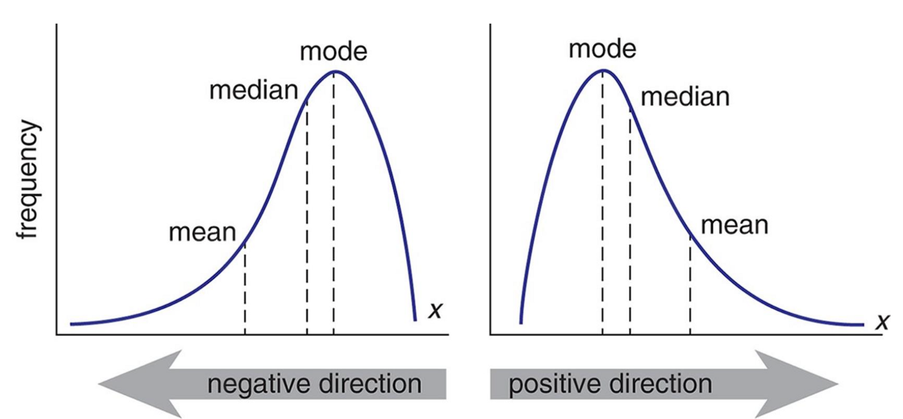
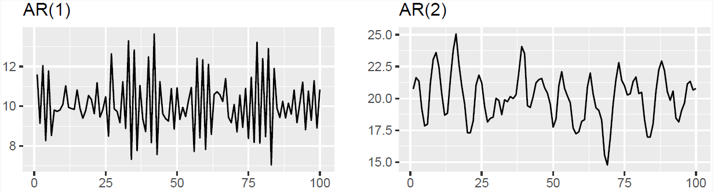

# Time series Econometrics (Lecture Notes)

## Introduction
###  Why Time series Modeling is different from other statistical models?

Before we dive into time series model, it is important to understand the difference 
between standard statistic models and time series. For example, what is the difference 
between AR model and an OLS ?

Based on the model equation, AR is a special case of OLS where the explanatory
variables are the lagged time series


$$AR(1): \quad y_t =\alpha + \beta \times y_{t- 1} + \epsilon_t$$
$$OLS: \quad y_t =\alpha + \beta \times X_t + \epsilon_t$$


However, AR models are fundamentally different from OLS models. Indeed, the former is based on **Extrapolation**, while the latter is based on **Interpolation**

### Interpolation
In the OLS models, both  X (the explanatory variables) and Y (the target variable) are observed at the same time. For any potential value of X, we can compute a predicted
value $\hat{Y}$ with a certain confidence


### Extrapolation
Structural time dependence, $\hat{Y}_{t+1}$ depend on $Y_{t}$
Predicting $\hat{Y}_{t+h}$ requires predicting all $\hat{Y}_{t+i}\quad \forall i \in [1,h- 1]$
Cumulative estimation error make the results unusable.

Intuitively, the farther we move in the future, the higher the chance of exogenous 
external shock occurring (Risk of structured breaks, innovation, macroeconomic shocks,
news...)  $\Rightarrow$ The lower the accuracy of the model


   
    
## Statistical Features and Properties of Financial Time series

Stylized Properties:   Fan and Yao (2015, the Elements of Financial Econometrics)
identify 8 main "stylized facts"
  -  Stationarity
  -  Absence of autocorrelations
  -  Heavy tails
  -  Asymmetry
  -  Volatility clustering
  -  Aggregational Gaussianity
  -  Long- range dependence
  -  Leverage effect
  
###  Stationarity
`````{admonition} Definition: Strong Stationarity
:class: definition
If ${y_t}$ is a stationary time series, then for any period $s$ in the future,
      the distribution $\{y_t, \dots, y_{t+s}\}$ doesn't depend on $t$
`````

`````{admonition} Definition: Weak Stationarity (Second Order Stationarity)
:class: definition 
   A stochastic process $X_{t} \in \mathbb{Z}$ is weakly stationary if and only if:
   -  $\mathbb{E}(X^2_t) < \infty \quad \forall~ t \in \mathbb{Z}$
   -  $\mathbb{E}(X_t) = \mu \quad \forall~t \in \mathbb{Z}$ doesn't depend on $t$
   -  $\mathbb{C}ov(x_t, x_{t+h}) = \mathbb{E}[(x_{t+h} -  m)(x_t -  m)]  = \gamma(h) \quad \forall~ (t, h)~ \in \mathbb{Z}^2$ doesn't depend on $t$
`````

Weak stationarity means that the stochastic process oscillates around a constant level, is not trending, and has the following properties: 
  
- The mean and time-covariance are constant over time
- Because the time-covariance is constant over time, it implies that the variance is also constant over time
  $$ \mathbb{V}(X_t) = \mathbb{C}ov(X_t, X_{t}) = \gamma(0) \qquad \forall t \in \mathbb{Z} $$
  
- $\mathbb{C}ov(X_t, X_{t}) = \gamma(h) \qquad \forall~ h \in  \mathbb{Z}$ can be interpreted as _covariance doesn't change when shifted in time_
  $$\mathbb{C}ov(X_r, X_s) = \mathbb{C}ov(X_{r+t}, X_{s+t}) \qquad \forall ~(r, s, t) \in \mathbb{Z}^3  $$
  
Therefore, a **stationary series** is:
 -  Roughly horizontal. The stochastic process oscillates around a constant level 
    $$\mathbb{E}(X_t) = \mu \forall t$$
 -  Constant variance. _covariance doesn't change when shifted in time_
    $$\mathbb{V}(X_t) = \mathbb{C}ov(X_t, X_t) = \gamma(0) \qquad \forall ~t~ \in~ \mathbb{Z}$$
 -  No predictable patterns in the long term  

  
`````{admonition} Fact N1: Retrurns are  stationary
:class: important 
In general, prices are non- stationary but returns are stationary
`````

           


#### How do you identify non- stationary series?
`````{admonition} Tip
:class: tip
It is easier to reject the stationarity of a time series rather than confirm it
`````


1. **Visually**: 

The time plot gives information on the first moments throw time. For example, it is easy to see
   - that $\mu$ is not constant, and the timeseries have a drift
   
   
   
   -  $\sigma$ is not constant, and changing over time
   
   
   
   -  Or the series presenting a seasonal pattern
   
   

2. **Global vs Local**: 

This technique consist in computing the first moments (mean, variance) locally and comparing them with the global moments computed on the entire time series.

Typical **structural breaks** can easily be identified by this technique. The figure below show a double structural break, occuring at time t=250, where a change of the mean is followed by an increase in volatility.


3. **ACF Analysis**
    -  The ACF of stationary data drops to zero relatively quickly
    -  The ACF of non- stationary data decreases slowly
    -  For non- stationary data, the value of the first coefficient is often large and positive


On the right panel, we see the ACF analysis of a stationary time series. The series is a white noise, given by $y_t = e_t$ where $e_t$ is a series of random variable that idependents and identically normally distributed $\forall ~ e_t \sim N(0,1)$. 
We note that the autocorrelation drops immediatedly to 0 at the first lag, and  it is insignificant for the rest of lags. Inversely, the left panel, shows a random walk, computed as the cumulative sum of white noise presented in the right panel. 
The timeseries is diffinately not stationary, and the ACF is decreasing slowly with the number of lags


4. **Unit Root Tests**: Statistical tests for the presence of unit roots
    -  **Augmented Dickey- Fuller** test: null hypothesis is that the data is **non- stationary and non- seasonal
    -  **KPSS** (Kwiatkowski- Phillips- Schmidt Shin) test: the null hypothesis is that the data is **stationary and non- seasonal
    -  Other tests are available for seasonal data

### Absence of autocorrelations
`````{admonition} Definition: Autocorrelation
:class: definition 
The autocorrelation denoted $\rho(k)$ is the correlation between the values of the process at different times:

$$\rho_k =  \mathbb{C}orr(X_t, X_{t- k})  = \frac{\mathbb{E}\left[ (X_t -  \mu)(X_{t- k} -  \mu)\right]}{\mathbb{V}(X_t)} = \frac{\gamma_k}{\sigma^2}$$

with $\mu = \mathbb{E}[X_t]$,  $\sigma^2 = \mathbb{V}(X_t), \forall ~t$ and $\gamma_k$ the autocovariance of order $k$  
`````

  
`````{admonition} Definition: Sample Autocorrelation
:class: definition 
$$\hat{\rho}_k = \mathbb{C}orr(X_t, X_{t- k}) = \frac{1}{(T- k)\hat{\sigma}^2} \sum_{t=k+1}^{R}(X_t -  \hat{\mu})(X_{t- k} -  \hat{\mu}) $$
where $\hat{\sigma}^2$ and $\hat{\mu}$ are consistent estimators of the mean $\mu = \mathbb{E}(X_t)$ and the variance $\sigma^2 = \mathbb{V}(X_t)~ \forall t$
`````

**Partial Autocorrelation:**

Autocorrelation of the term at lag $k$ with the current value of the time series, $\mathbb{C}orr(X_t, X_{t- k})$, can be a simple artifact of a compounding effect of the predominant correlation of the terms at shorter lags.
Typically, for an AR(1) model, because $|\mathbb{C}orr(X_t, X_{t- k})| >0 ~\forall t$ so  $|\mathbb{C}orr(X_{t-1}, X_{t- 2})| >0$ so $X_{t-2}$ impacts $X_t$ through $X_{t-1}$

`````{admonition} Definition: Partial autocorrelation
:class: definition 
Partial autocorrelation at lag k is the correlation after removing the effect of the terms at shorter lags
`````


#### Examples:
Example 1: Autocorrelation of the US CPI
 
 -  Highly significant autocorrelation in the first 20 lags
 -  However, PACF displays one single significant bar at the first lag
 -  Relation between t and t- s, s >1 goes through t- 1
 -  AR(1) model is the best fit to the time series
 
Example 2: Autocorrelation of the SP500
 
 -  The fact that returns hardly show any serial correlation does not mean that they are independent
 -  Financial time series are difficult to model. That's why we need Quants! 

`````{admonition} Fact N2: Absence of autocorrelation
:class: important
The autocorrelations of assets returns are often insignificant, except for intraday time scales (around 20 minutes) for which the microstructure effects come into play
````` 

### Heavy Tails

  -  "Heavier tails" are rigorously defined by the kurtosis, which is the fourth- order moment (see before)
  -  Mandelbrot (1963) recognized the heavy- tailed, highly peaked nature of certain financial time series
  -  These heavy tails can be explained by risk aversion, heard behavior, and market microstructure (illiquidity, asymmetric information, etc.)
      
Forms of Kurtosis (Fat Tails): There are different shapes of kurtosis: 


`````{admonition} Fact N3: Heavy Tails
:class: important
The probability distribution of many financial variables, including asset returns, often exhibit **heavier tails** than those of a normal distribution
````` 
### Asymmetry
-  Asymmetry is defined by the skewness, which is the third- order moment
-  This reflects the fact that the downturns of financial markets are often much steeper than the recoveries
-  Investors tend to react more strongly to negative news than to positive news 
-  Rush toward the exit door/ flight to safety
  


-  Skew $= 0 \Rightarrow$  Symmetric distribution $\Rightarrow$ **Mean = **Median
-  Skew $\geq 0 \Rightarrow$ Positive skew implies that the **Mean is driven by a small number of high values
-  Skew $\leq 0 \Rightarrow$ Positive skew implies that the **Mean is driven by a small number of small values
  
`````{admonition} Fact N4: Asymmetry
:class: important
The distribution of many financial variables, including asset returns, are often **asymmetric and **negatively skewed
`````   
### Volatility Clustering
`````{admonition} Fact N5: Volatility Clustering
:class: important
Large price changes tend to be followed by large price changes (up and down). It means
that returns with large absolute values or large squares occur in clusters
`````   

> **Note**: volatility clustering is the consequence of the autocorrelation of the squared returns


Example: The VIX is the implied volatility of the US SP 500, displays volatility regimes: 
Periods of tranquility alternate with periods of high volatility (volatility regimes)


### Long Range Dependence
  
  
The ARCH effect 
  -  The autocorrelation of the squared returns is called the **ARCH effect (auto- regressive conditional heteroskedasticity)
  -  ARCH effect is important in finance, because it describes patterns in the dynamic of financial volatility 
  -  Those autocorrelations become weaker and less persistent when the sampling interval is increased to a week or a month
  
SP 500 Returns (left) and squared returns (right)
  

`````{admonition} Fact N6: Long Memory
:class: important
At the difference of returns, squared returns and absolute returns exhibit significant autocorrelations (**long- memory**)
````` 
### Leverage Effect
`````{admonition} Fact N7: the Leverage Effect
:class: important
Assets returns are negatively correlated with the changes in their volatilities
````` 
   
Financial explanations
As asset price declines, companies mechanically become more leveraged (debt- to- equity ratio increases) and riskier: therefore, their stock prices become more volatile. Subsequently, 
when stock prices become more volatile, investors demand high returns (risk premium), and hence stock prices go down

Volatilities caused by price decline are typically larger than prices appreciation due to declined volatilities
    
### Aggregational Gaussianity

-  Asset returns over $k$ days is simply the aggregation of $k$ daily returns
-  When the time horizon $k$ increases, the central limit theory says that the distribution of returns over a long- time horizon (a few months) tends toward a **normal distribution**

`````{admonition} Fact N8: Aggregational Gaussianity
:class: important
Over long horizons, the peculiarities of financial time series over short- term horizons (skewness, kurtosis, ARCH effect etc.) tend to vanish
`````

Dispite this nice feature, people are mostly interested in relatively short- term movements, suggesting that working under the Gaussianity assumption is often not appropriate  
  


## Useful Techniques: Differencing

### Differencing
  -  Differencing helps to **stabilize the mean**
  -  The differenced series is the *change* (or first difference) between each observation in the original series: $y'_t = y_t -  y_{t- 1}$
  -  The differenced series will have only $T- 1$ values since it is not possible to calculate a difference $y'_1$ for the first observation


Suppose 
$$y_t = \beta_0 + \beta_1 \times t + \epsilon_t$$

Let $$ z_t = \Delta y_t = y_t -  y_{t- 1}$$

$$
\begin{align*}
z_t &= (\beta_0 + \beta_1 \times t+ \epsilon_t) -  (\beta_0 + \beta_1 \times (t- 1) + \epsilon_{t- 1})\\
    &= \beta_1 + (\epsilon_t -  \epsilon_{t- 1})\\
    &= \beta_1 + \nu_t \sim  N(0, \sqrt{2\sigma^2}) \\
\end{align*}
$$


### Second- Order Differencing:
Occasionally, the differenced data will not appear stationary and it may be necessary to differentiate the data a second time:

$$y''_{t} = y'_t -  y'_{t- 1} = (y_t -  y_{t- 1}) -  (y_{t- 1} -  y_{t- 2}) $$

  -  $y''_{t}$ will have $T- 2$ values
  -  In practice, it is almost never necessary to go beyond second- order differences
  
### Seasonal Differencing
`````{admonition} Defintion: Seasonal Difference
:class: definition
A seasonal difference is a difference between an observation and the corresponding observation from the previous "season"

$$y'_t = y_t -  y_{t- m}$$

where $m$ is the number of observations in a "season". For example, for monthly data, $m = 12$, for quarterly data, $m = 4$      

````` 
    
`````{admonition} When both seasonal and first differences are needed
:class: tip

-  It makes no difference which one is done first -  the result will be the same
-  If seasonality is strong, we recommend that seasonal differencing be done first because sometimes the resulting series will be stationary and there will be no need for the further first difference
-  It is important that, if differencing is used, the differences are **interpretable: for instance, taking lag 3 differences for yearly data is difficult to interpret
`````

### Backshift Notation

`````{admonition} Notation
:class: definition
The backshift notational device, $B$ is used as follows:    

$$B y_t = y_{t-1}$$
    
$B$ operating on $y_t$ has the effect of **shifting the data back one period**.
`````

Two applications of $B$ to $y_t$ shifts the data back **two periods**

$B(B y_t) = B^2 y_t = y_{t-2}$         
    
$B$ depends on the period / frequency considered. Shifting monthly data by a year supposes using $B^{12}$    


`````{admonition} Backshift Operator and Differencing
:class: tip    
The backshift operator is convenient for describing differencing  
    $y'_t = y_t - y_{t-1} = y_t - By_t = (1-B)y_t$
`````

Likewise, second-order differences are obtained with $y''_t = (1-B)^2y_t$  

Pay attention !! 
The second-order difference is not second difference 
   - Second order difference: $(1-B)^2 y_t = y''_t = (y_t - y_{t-1}) - (y_{t-1} - y_{t-2})$
   - Second difference: $1-B^2 y_t = y_t - y_{t-2}$
      
  

## ARMA type models

### Autoregressive (AR) Models

`````{admonition} Definition:
:class: defintion
 AR model is a multiple regression with **lagged variables**
 
$$y_t = c + \phi_1 y_{t- 1} + \phi_2 y_{t- 2} + \dots + \phi_P y_{t- p} + \epsilon_t$$
   
where $\epsilon_t$ is a white noise        
`````

   

AR(1) Model
$ y_t = c + \phi_1 y_{t- 1} + \epsilon_t $
    
  -  When $\phi_1=0$, $y_t$ is equivalent to a **white noise**
  -  When $\phi_1=1$ and $c=0$, $y_t$ is equivalent to a **random walk**
  -  When $\phi_1=1$ and $c \neq 0$, $y_t$ is equivalent to a **random walk with drift**
  -  When $\phi_1<0$ and $c=0$, $y_t$ is **mean reverting**. It tends to oscillate between positive and negative values 
    
#### Stationarity Conditions


`````{admonition} General Condition for Stationarity
:class: caution
To restrict AR models to stationary data, some constraints on the coefficients are needed
Complex roots of the polynomial $\mathcal{P}(z) = 1 - \phi_1z - \phi_2 z^{2} - \dots \phi_p z^{p}$ lie outside the unit circle of the complex plane
`````
  
Intuitively, for an AR(1) model, the backshift polynomial is 


\begin{align*} 
y_t = \phi_1 y_{t-1} + \epsilon_t & \leftrightarrow \ y_t(1-\phi_1B) = \epsilon_t \\
(1-\phi_1B) = 0 & \leftrightarrow \ B= \underbrace{\frac{1}{\phi_1}}_{\text{Not explosive}}
\end{align*} 


To get the AR expression not explosive, we need $|\frac{1}{\phi_1}| < 1$ and therefore $|\phi_1| > 1$ 
  
For low lags orders, the stationarity conditions are simply:
  
  - For $p=1$: $- 1 < \phi_1 < 1$
  - For $p=2$:  $- 1 < \phi_2 < 1$, $ \phi_1 + \phi_2 < 1$ and $ \phi_2 -  \phi_1 < 1$
  - More complex conditions hold for $p \geq 3$
  - Estimation software (R, Python, Eviews, etc.) takes care of this
  
#### Statistical Test: Dickey- Fuller Test
It sometimes easy to see if a timeseries is non-stationary, by sometimes the presence of a unit rood is difficult to identify. In such cases, we have to rely on formal statistical test

In the following, we are going to explain how the Dickey-Fuller test can be used to test whether a time series following an AR(1) model is stationary

$$AR(1): \quad y_t =\alpha + \phi_1 \times y_{t-1} + \epsilon_t$$
**Hypothesis testing**

$\left\{\begin{matrix}
H0: & y_t~ \text{has a unit root}  & \Rightarrow \phi_1 =1\\
H1: & y_t~ \text{has no unit roots} & \Rightarrow \phi_1 < 1\\ 
\end{matrix}\right\}$

$$\Delta y_t =\alpha + \delta \times y_{t-1} + \epsilon_t, \quad where \quad \delta = \phi_1 - 1$$

With this change of variable the hypothesis testing become

$\left\{\begin{matrix}
H0: & y_t~ \text{has a unit root}  & \Rightarrow \delta =0\\
H1: & y_t~ \text{has no unit roots} & \Rightarrow \delta < 0\\ 
\end{matrix}\right\}$

If the null hypothesis _H0_ is true, $\delta =0$ and $\Delta y_t$ is a  random walk
As per any hypothesis testing for the significance of the parameters of a regression, we compute the t-statistic $w = t_{\hat{\delta}} = \frac{\hat{\delta}}{std(\hat{\delta})}$. 
However, since $y_t$ is supposed not stationary under the null hypothesis, the distribution of the statistic is not compared with a t-distribution but with the Dickey-Fuller distribution


#### How to identify the order of an AR process
By definition, PACF gives the direct effect of lag k on the current value of the time series. Therefore, the PACF allow us to easily identify the order of an AR generated process
   
Let's consider the following time series, obeying to an AR(2) model
    
$y_t =\alpha - 0.5 \times y_{t- 1} + 0.8 \times y_{t- 2} + 0.4 \times y_{t- 3} + \epsilon_t$
    
The PACF, plotted in the middle panel, shows significant autocorrelations exactely on the lags where the autocorrelation exist (as per the true data generating process). On the contrary, the ACF has multiple significant lags until lag 10
    
   


### MA: Moving Average Model
`````{admonition} Moving Average Model
:class: definition
MA model is a multiple regression with **past errors** as predictors

$$ y_t = c + \epsilon_t + \theta_1 \epsilon_{t- 1} + \theta_2 \epsilon_{t- 2} + \dots + \theta_q \epsilon_{t- q}   $$

where  $\epsilon_t$ is a white noise
`````
> Caution: Do NOT confuse this with _moving average smoothing_!
  

     


#### How to identify the order of an MA process
Suppose the following MA(q) model

$MA(q):\quad X_t = \mu +\phi_1\epsilon_{t-1}+\phi_2\epsilon_{t-2}+...+\phi_q\epsilon_{t-q}+\epsilon_{t}$

The ACF computes the correlation between $X_t$ and $X_{t-k}$
$\mathbb{C}orr(X-t, X_{t-k}) = E[X_tX_{t-k}] - E[X_t]E[X_{t-k}]$

\begin{align*}
X_t &:[\epsilon_t, \epsilon_{t-1}, \epsilon_{t-2}, ..., \epsilon_{t-q}] \\
X_{t-k}&:[\epsilon_{t-k}, \epsilon_{t-k-1}, \epsilon_{t-k-2}, ..., \epsilon_{t-k-q}]
\end{align*}

\begin{align*}
\mathbb{C}orr(X-t, X_{t-k}) & \neq 0 \quad IF  \quad t-q \leq t-k \Rightarrow k \leq q \\
                   & = 0 \quad otherwise
\end{align*}

From an ACF we can deduce the order of the MA model as the lag on which the correlation turns to 0

`````{admonition} Example MA(3)
:class: tip 
$MA(3):\quad X_t = 50 +5\times\epsilon_{t-1}+3\times\epsilon_{t-2}+ 10\times\epsilon_{t-3}+\epsilon_{t}$


`````
#### Invertibility: From MA(q) to AR($\infty$) and From $AR(p)$ to MA($\infty$) Model
`````{admonition} Wold Decomposition
:class: definition  
It is possible to write any **stationary** $AR(p)$ model as an MA($\infty$)
`````
Intuitive: just go backward!
\begin{align*}
y_t &= \phi_1 \underbrace{y_{t-1}}_{} + \epsilon_t$\\
    &= \phi_1 (\phi_1 y_{t-1} + \epsilon_{t-1}) + \epsilon_t\\
    &= \phi_1^2 y_{t-2} + \phi_1\epsilon_{t-1} + \epsilon_t\\
& \dots\\
   &= \epsilon_t + \phi_1 \epsilon_{t-1} + \phi_1^2 \epsilon_{t-2} + \phi_1^3 \epsilon_{t-3} + \dots\\
   &= \epsilon_t + \sum_{i=1}^{\infty} { \phi_i \epsilon_{t-i}} 
\end{align*}

Providing that $1 < \ \phi_1 \ < 1$:


`````{admonition} MA invertibility
:class: definition  
Under certain conditions, it is possible to write $MA(q)$ model as AR($\infty$) process. In this case, the MA model is said to be **invertible**
`````

`````{admonition} General Condition for MA(q) Invertibility
:class: caution
To insure MA models invertibility, some constraints on the coefficients are needed
Complex roots of the polynomial $\mathcal{P}(z) = 1 + \theta_1z + \theta_2 z^2 + \dots + \theta_q z^q$ lie outside the unit circle of the complex plane
`````

- For q =1: $- 1 \ < \theta_1 \ <1$
- For q=2:
    - $- 1 \ < \theta_2 \ <1$
    - $\theta_1 + \theta_2 > - 1$ and $\theta_1 -  \theta_2 \ < 1$
- More complicated solutions hold for $q \geq 3$ Estimation software takes care of this
- Invertible models have some mathematical properties that make them easier to use in practice
- This is intuitive: AR processes are embedding new information on the most recent lags 


### ARMA(p, q) Model
`````{admonition} Defintion
:class: definition
$$
  y_t = c + \underbrace{\phi_1 y_{t-1} + \dots + \phi_p y_{t-p}}_{\text{AR}} + \underbrace{\theta_1 \epsilon_{t-1} + \dots + \theta_q \epsilon_{t-q}}_{\text{MA}} + \epsilon_t
$$
The predictors include both **lagged values** of $y_t$ and **lagged errors**
`````

- Important specification: the future value of the series depends both on the past values it took (dynamic), as well as recent random noise/error term 
- This simple model is "learning" both from the dynamic of the past values and from its inherent randomness
- Conditions on AR coefficients ensure **stationarity**
- Conditions on MA coefficients ensure **invertibility**
  

### Autoregressive Integrated Moving Average (ARIMA)

ARIMA: AR**I**MA stands for: Autoregressive **Integrated** Moving Average model

`````{admonition} Tip
:class: tip    
Basically, it is a non- stationary model that can be made stationary by differencing $d$ time 
  - $(1- B)^d y_t$ follows an ARMA model, where $d$ is the degree of differencing until the series becomes stationary
  - Once differenced $d$ times, it is stationary and behaves as an ARMA model
`````
    
Let's consider the $ARIMA(p, d, q)$ where $p$ is the autoregressive order, $d$ the degree of differencing and $q$ the order of the moving average part. All linear models we discussed are special cases of the ARIMA model:
 
- White noise model: $ARIMA(0, 0, 0)$
- Random walk: $ARIMA(0, 1, 0)$ with no constant
- Random walk with drift: $ARIMA(0, 1, 0)$ with constant  
- $AR(p) = ARIMA(p, 0, 0)$ , $MA(q) = ARIMA(0, 0, q)$


### Seasonal ARIMA (SARIMA)
`````{admonition} Defintion
:class: definition
ARIMA  $ \underbrace{(p, d, q)}_{_{\text{Non-Seasonal part of the model}}} \qquad \qquad \underbrace{(P, D, Q)_m}_{\text{Seasonal part of the model}}$

where $m$ is the number of observations in a cycle
`````
   
`````{admonition} Example: $ARIMA(1,1,1)(1,1,1)_4$, without constant
:class: tip
$$\underbrace{(1-\phi_1B)}_{\text{Non-Seas. AR1}} \underbrace{(1-\Phi_1B^4)}_{\text{Seas. AR1}}\underbrace{(1-B)}_{\text{Non-Seas. Diff.}} \quad = \quad \underbrace{(1+\theta_1 B)}_{\text{Non-seas. MA(1)}} \underbrace{(1+\Theta_1 B^4)}_{\text{Seasonal MA(1)}}\underbrace{(1-B^4)}_{\text{Seas. Diff.}}\epsilon_t $$

All factors can be multiplied to obtain the model's component form
`````

The seasonal part of an AR or MA model will be seen in the seasonal lags of the PACF and ACF

-  $ARIMA(0,0,0)(0,0,1)_{12}$  will show   
    - A spike at lag 12 in the ACF but no other significant spikes
    - The PACF will show exponential decay in the seasonal lags; that is, at lags 12, 24, 36, etc.

- $ARIMA(0,0,0)(1,0,0)_{12}$  will show   
    - Exponential lags in the seasonal lags of the ACF
    - A single significant spike at lag 12 in the PACF
    
    
  
#### Treatment of Seasonality

Daily data can exhibit multiple seasonal periodicities. This is a complication for all high- frequency forecasting problems. This comes with additional complexity. For instance, 
- Months has different number of days
- Leap years with different number of days
- Weeks do not align with daily cycles (the year is not divisible in an exact number of weeks)
- Some major events are based on the week within the month regardless of the exact day. For example, 
    - Options and futures expires on the 3rd friday of March, June, September and December
    - Options expiries induce large volumes and volatility in the market as market participant either roll their positions or shuffle their portfolios

- Seasonality can be irregular: 
    - Ramadan is moving by 11 to 12 days backward from one year to another. Thus it can overlap between 2 months
    - Chinese new year
    - Some other religious festivities

To deal with such complex seasonality, one can rely on two approaches         
- Simplification of seasonal terms
- Trigonometric representation of seasonality: Fourier transform    
- Avoid including a large number of binary variables (“dummies”) to capture different seasonality patterns


**Binary seasonality**, the fact of introducing a bunch of binary variables (“dummies”) to capture the different seasonality patterns, should be discourage, because:
- Including a large number of variables imply to estimate many more parameters, hence **adding parametric noise** to the model
- Many parameters are not relevant/useful, **increasing noise/signal ratio**
- Reducing the degrees of freedom spurs the **risk of overfit**

We tested a large number of models in different countries, confirming the relatively bad performance of ARIMA with binary seasonality   


## Empirical Strategy

### What is a White noise ?
`````{admonition} Defintion
:class: definition
A time series is a white noise if the variables are independent and identically distributed with a mean of zero.

$\left\{\begin{matrix}
 \forall t, & \mathbb{E}[\epsilon_t] = 0 \\
 \forall t, & \mathbb{V}ar[\epsilon_t] = \sigma^2 \\
 \forall t,s & (\epsilon_t, \epsilon_{s}) \quad independent \\    
\end{matrix}\right.\}$   

`````

**Why does it matter?**
$$y_t = Signal + Noise $$
   
- Noise is the unpredictable part of the time series that can not be modeled. Complete randomness 
- As long as the residuals of the model have structure, the model is not capturing the whole signal but only part of it
- Stop modeling when the series of errors from a time series forecast model is behaving like a white noise
        
### Empirical Strategy
The general approach of (financial) econometrics is as follows:
- Specification of the model
- Estimation of the parameters
- Diagnostic tests
    - Significance tests
    - Specification tests
    - Backtesting tests
    - etc.
- Interpretation and use of the model (forecasting, historical studies, etc.) 

To Specify an Appropriate Time Series Model
- Study some **statistical properties** of the observed data $\{x_t\}$, for instance, the **stationarity**, the patterns of the autocorrelation function **ACF**, or the partial autocorrelation function **PACF**, etc.
- Compare these properties to the theoretical properties of some **typical time series models**, such as AR, MA, ARIMA, SARIMA, etc.
- Choose the most appropriate model and **estimate its parameters**
- Use this model for forecasting


#### Model Comparison and parameters Selection
 
To compare models in terms of performance and specification, we can rely on the AIC/BIC 
`````{admonition} Aikaike Information Criteria (AIC)
:class: definition

$$ AIC = -2 \text{log}(L) + 2(p+q+k+1) \left[ 1 + \frac{(p+q+k+2)}{T-p-q-k-2} \right]    $$
   
where $L$ is the maximized likelihood fitted to the differenced data, and $k$ denote the degrees of freedom: if the model embeds a constant $c$, $k=1$, else $k=0$
`````
 
The algorithm to select parameters

`````{admonition} ARIMA Specification
:class: caution  
$$ \phi(B) (1- B)^d y_t = c + \theta(B) \epsilon_t $$

Need to select the appropriate order for $p, q, d$
`````

**Hyndman and Khandasar (2008)** selection algorithm:
  - Select the differencing order (the required number of differences) $d$ and $D$ using KPSS test
  - Select $p, q$ by minimizing AICs
  - Use stepwise search to traverse model space (test different combinations of $p, q$ for robustness)
    - Select the current model, with the smallest AIC from the most parsimonious
        - ARIMA(0,d, 0), ARIMA(1, d, 0), ARIMA(0, d, 1), ARIMA(1, d, 1) and ARIMA(2, d, 2)

    - Consider **variations** of the current model:
        - Vary one of $p, q$ from current model by $\pm 1$
        - $p, q$ both vary from current model by $\pm 1$
        - Include/exclude the constant $c$ from the current model

    - The model with the lowest $AIC$ becomes the current model. Repeat step 2 until no lowest AIC can be found (traverse model space) 
  

#### General Apporach

 The graph below details the procedure:
- Start with **Plotting the data** to identify any unusual observations
- If necessary, **transform the data** (using a Box-Cox transformation) to stabilize the variance
- If the data are non-stationary, **first-difference** it until it becomes stationarity
- **Examine the ACF/PACF**: will allow you to answer the question: Is an $AR(p)$ or $MA(q)$ reasonable assumptions?
- Try your chosen models: use AIC/BIC to compare with other models
- Plot the residuals, look at the residuals ACF. Residuals should look like a **white noise**. As long as the residuals of the model have a time-varying structure, the model is not capturing the whole signal but only part of it
- Once the residuals look like a white noise, your modelization is complete, **compute the forecasts**    

     
 


     


