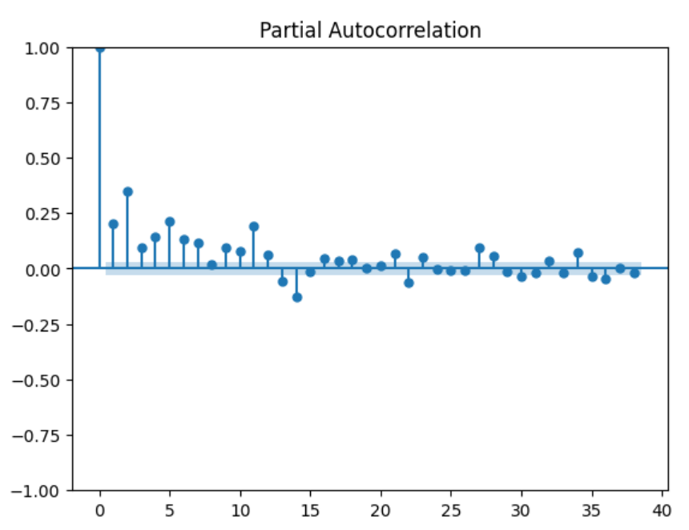
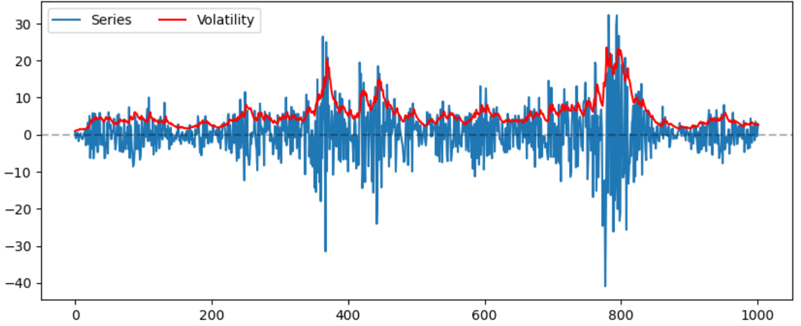
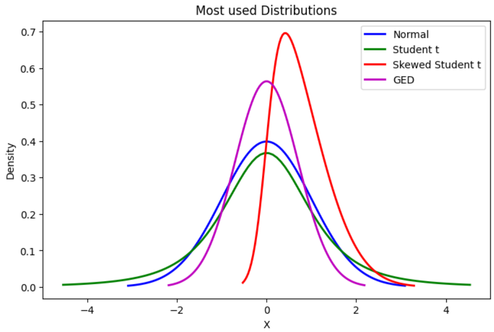
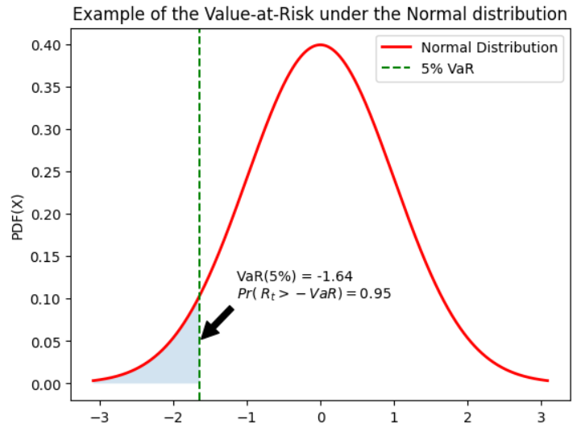
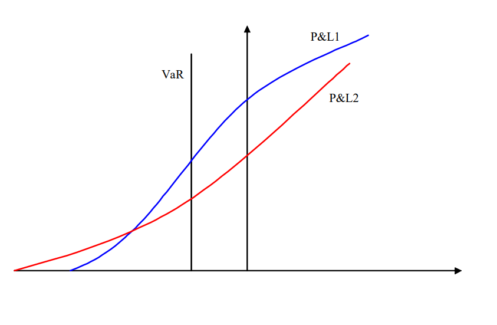
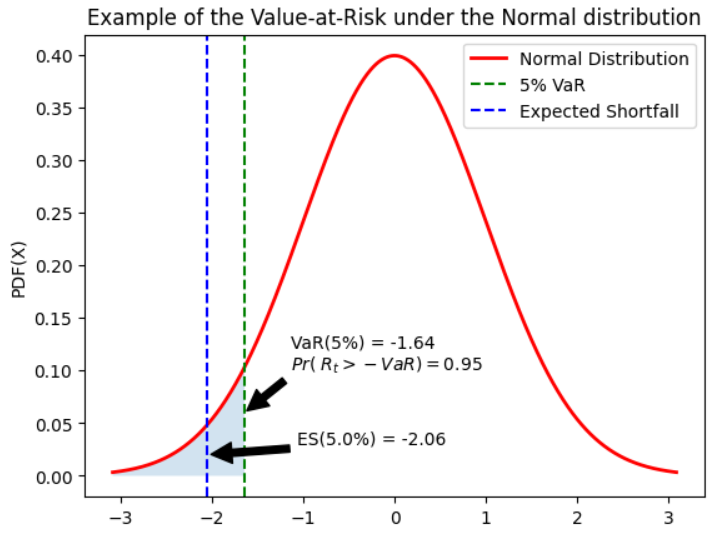

# Advanced Volatility Modeling (Lecture Notes)

## Introduction

 
**Challenges in estimating volatility**

-   Daily volatility is unobserved, and can not be derived from the
    daily returns $R_t$ because there is only one observation in a
    trading day t

-   Volatility of price returns is not static, It changes frequently for
    several reasons

**Why does volatility change?**

-   <span style="color:rgb(0, 76, 151);">**News Announcements**</span>: Macroeconomic and
    earnings announcement. As new information arrives, uncertainty rises
    regarding interpreting it and reshuffling portfolios.

-   <span style="color:rgb(0, 76, 151);">**State of Uncertainty**</span>: Brexit, Trump
    election, Covid-19, SVB

-   <span style="color:rgb(0, 76, 151);">**Illiquidity**</span>: Price movement upon
    taking directional bets on illiquid assets is high

-   <span style="color:rgb(0, 76, 151);">**Volatility Feedback:**</span>: Market-Makers
    behavior, fleeing the order book when volatility increase (when it
    matters the most)

-   <span style="color:rgb(0, 76, 151);">**Leverage**</span>:An price declines, companies
    become more leveraged (debt-to-equity ratio up) and riskier


**Volatility Estimates**

1.  <span style="color:rgb(0, 76, 151);">**Realized Volatility**</span>, but on what
    window ?
    
    $$\hat{\sigma} = \sqrt{ \frac{1}{T} \sum_{t=1}^T (r_t - \hat{\mu})}$$

2.  <span style="color:rgb(0, 76, 151);">**Implied volatility**</span> the volatility
    which when input in an option pricing model (such as Black-Scholes)
    will return the market price of the option. Example: the CBOE
    Volatility Index (ticker: VIX).

3.  <span style="color:rgb(0, 76, 151);">**High Frequency Data Estimators**</span>. The
    realized volatility is computed as the sum of squared intraday
    returns (Andersen and Bollerslev, 1998).

4.  <span style="color:rgb(0, 76, 151);">**Conditional Volatility**</span> issued from
    dynamic models such as the **ARCH** and **GARCH** type models
    $\mathbb{E}_t[\sigma_{t+1}^2]$


 

**How ARCH/GARCH models cover the properties of financial time series?**
Stylized Facts of Financial Time series 
1.  The returns are stationary

2.  Absence of autocorrelations

3.  Heavy tails

4.  Asymmetry

5.  Volatility clustering

6.  Aggregational Gaussianity

7.  ARCH effect

8.  Leverage effect


## ARCH Models

 
ARCH Models The ARCH model has been introduced by [Engle (1982)](https://www.jstor.org/stable/1912773)

**ARCH** = **A**uto**R**egressive **C**onditional **H**eteroskedasticity
Robert F. Engle Nobel Prize 2003


-   The squared return follows an <span style="color:rgb(0, 76, 151);">**autoregressive model**</span>.

-   The term <span style="color:rgb(0, 76, 151);">**heteroscedasticity**</span>. refers to a time-varying variance.

-   In an ARCH model, it is the <span style="color:rgb(0, 76, 151);">**conditional variance**</span> (and not the variance itself) that changes with time, in a specific way, depending on the available data.


`````{admonition} Definition: ARCH Models
:class: definition
ARCH(q) The process $X_t, t\in \mathbb{Z}$ is said to be an ARCH(q) process, if

$$X_t = Z_t\sigma_t$$ 

where $Z_t$ is a sequence of independent and identically distributed (i.i.d.) random variables with $\mathbb{E}(Z_t) = 0$ and $\mathbb{V}(Z_t) = 1$, and $\sigma_t$ is a
non-negative process such that

$$\sigma_t^2 = \alpha_0 + \sum_{i-1}^P {\alpha_{i}X_{t-i}^2}$$ 

with $\alpha_0>0,~ \alpha_i \in \mathbb{R}, \quad \forall i<P, \alpha_p\in \mathbb{R}^*$ and $\sum_{i-1}^P {\alpha_{i}} <1$
`````

 
Consider an ARCH(1) process 

$\begin{aligned}
    X_t & = Z_t\sigma_t\\
    \sigma_t^2 &= \alpha_0 +\alpha_1X_{t-1}^2
\end{aligned}$

Then we have 

$$\mathbb{V}(X_t|\underline{X}_{t-1}) = \mathbb{V}(Z_t\sigma_t|\underline{X}_{t-1}) = \sigma_t^2\mathbb{V}(Z_t|\underline{X}_{t-1}) =\sigma_t^2\mathbb{V}(Z_t) = \sigma_t^2$$

-   Given the past information $\underline{X}_{t-1}$, the conditional
    variance $\sigma_t^2 = \alpha_0 +\alpha_1X_{t-1}^2$ is<span style="color:rgb(0, 76, 151);">**deterministic**</span>, since $x_{t-1}$ is a
    constant

-   The process $Z_t, t\in \mathbb{Z}$ is an i.id noise, so
    $\mathbb{V}(Z_t|\underline{X}_{t-1}) = \mathbb{V}(Z_t)$ i.e. there
    is no memory in $Z_t$

-   The normalization $\mathbb{V}(Z_t)=1$ is not a restriction: the
    scaling implied by any other variance would be absorbed by the
    parameters $\alpha_0$ and $\alpha_1$

`````{admonition} Definition: Conditional Variance
:class: definition
The process $\sigma_t^2$ corresponds to the **conditional variance** of $X_t$

$$\mathbb{V}(X_t|\mathcal{F}_{t-1}) \equiv \mathbb{V}(X_t|\underline{X}_{t-1}) = \sigma_t^2$$

where $\mathcal{F}_{t-1} \equiv \underline{X}_{t-1} = \{X_{t-1}, X_{t-2}, ... \}$ is the information set available at time $t-1$
`````

Some authors denote the conditional variance by $h_t$, with

$\begin{aligned}
X_t &= Z_t\sqrt{h_t}\\
h_t & = \alpha_0 +\alpha_1X_{t-1}^2    
\end{aligned}$


 
### Key properties of ARCH models

If $X_t,~t \in \mathbb{Z}$ has an ARCH(1) representation with Gaussian innovations, then

1.  $X_t^2$ has an AR(1) representation

2.  $X_t$ is a martingale difference

3.  $X_t$ is a stationary process under some conditions on the
    parameters

4.  $X_t$ is (unconditionally) Homoscedastic

5.  $X_t$ is conditionally Heteroscedastic

6.  The (marginal) distribution of $X_t$ is leptokurtic

7.  The conditional distribution of $X_t$ is normal


 
`````{admonition} Property 1:
:class: important

If $\{ X_t, t\in\mathbb{Z}\}$ has an ARCH(1) representation, with 

$$\begin{aligned}
X_t & = Z_t\sigma_t\\
\sigma_t^2 &= \alpha_0 +\alpha_1X_{t-1}^2
\end{aligned}$$

then $\{ X_t^2, t\in\mathbb{Z}\}$ has an AR(1) representation, with 

$$X_t^2 = \alpha_0 +\alpha_1X_{t-1}^2 + \nu_t$$

where $\nu_t$ is an innovation process $\mathbb{E}[\nu_t|\underline{X}_{t-1}] =0$
`````

<span style="color:rgb(0, 76, 151);">**Consequences:**</span>

$X_t^2$ and $X_{t-k}^2$ are correlated $\Rightarrow$ **ARCH effect**

$\rho_k = \mathbb{C}orr(X_t^2, X_{t-k}^2) \neq 0$, especially for small values of k

`````{admonition} Property 1: *Proof* 
:class: note

Consider the following ARCH process

$\begin{aligned}
X_t & = Z_t\sigma_t\\
\sigma_t^2 &= \alpha_0 +\alpha_1X_{t-1}^2    
\end{aligned}$

Add $X_t^2$ on both sides of the second equation and rearrange, we get 

$\begin{aligned}
X_t^2 &= \alpha_0 +\alpha_1X_{t-1}^2 + (X_t^2 - \sigma_t^2)\\
      &= \alpha_0 +\alpha_1X_{t-1}^2 + (Z_t^2\sigma_t^2 - \sigma_t^2)\\  
      & = \alpha_0 +\alpha_1X_{t-1}^2 + \sigma_t^2(Z_t^2 - 1)\\   
\end{aligned}$

$\nu_t= X_t^2 - \sigma_t^2 = \sigma_t^2(Z_t^2 - 1)$ is an innovation, i.e $\mathbb{E}[\nu_t|\underline{X}_{t-1}]=0$

$\begin{aligned}
\mathbb{E}[\nu_t|\underline{X}_{t-1}] &= \mathbb{E}[\sigma_t^2(Z_t^2 - 1)|\underline{X}_{t-1}]\\
                                &= \sigma_t^2 \mathbb{E}[(Z_t^2 - 1)|\underline{X}_{t-1}]\\
                                &= \sigma_t^2 ( \mathbb{E}[Z_t^2|\underline{X}_{t-1}]-1)\\
                                &= \sigma_t^2 (\mathbb{V}(Z_t) - 1)  = 0
\end{aligned}$
`````

The figure below, shows how significant is the autocorrelation of squared returns
{width=".8\\textwidth"}

 
`````{admonition} Property 2:
:class: important 
If $\{ X_t, t\in \mathbb{Z}\}$ is an ARCH(1) process, then it is a martingale difference

$$\mathbb{E}[X_t|\mathcal{F}_{t-1}] \equiv \mathbb{E}[X_t|\underline{X}_{t-1}] =0$$
`````

<span style="color:rgb(0, 76, 151);">**Consequences:**</span>
-   **The very best** (linear or nonlinear) **predictor of $X_t$** based
    on the available information at time $t-1$ **is** simply the trivial
    predictor, namely **the series mean, 0.**

-   This property implies that
    $\mathbb{C}ov(X_t,X_{t-k}) =0\quad \forall k \neq 0$, i.e that the
    process $X_t$ has **no memory**

-   In terms of point forecasting of the series itself, then, the ARCH
    models offer no advantages over the linear ARMA models.

`````{admonition} Property 2: *Proof* 
:class: note

Consider the following ARCH process

$\begin{aligned}
X_t & = Z_t\sigma_t\\
\sigma_t^2 &= \alpha_0 +\alpha_1X_{t-1}^2    
\end{aligned}$

$X_t$ is a martingale difference, since 

$\begin{aligned}
\mathbb{E}[X_t|\underline{X}_{t-1}] &= \mathbb{E}[Z_t\sigma_t|\underline{X}_{t-1}]\\
                              &= \sigma_t\mathbb{E}[Z_t|\underline{X}_{t-1}]\\
                              &= \sigma_t\mathbb{E}[Z_t]\\
                              &= 0\\
\end{aligned}$

Since $Z_t$ is an i.i.d process of mean 0
`````

| Innovation             | ARCH model                           | Output                |
|------------------------|--------------------------------------|-----------------------|
| $Z_t$ i.i.d noise       | $X_t = Z_t\sigma_t$                  | $X_t$ is martingale    |
| No correlation         | $\sigma_t^2 = \alpha_0 +\alpha_1X_{t-1}^2$ | No correlation between $X_t$ and $X_{t-k}$ |
| between $Z_t$ and $Z_{t-k}$ |                                      | but $\mathbb{C}ov(X_t^2,X_{t-k}^2) \neq 0$ |


 
- ARCH effect The daily squared returns often exhibit significant correlations. These autocorrelations are often referred to as an ARCH effect.
- Absence of autocorrelation: The **autocorrelation** of asset returns $R_t$ are often insignificant, except for very small intraday time scales ($\approx$ 20 minutes) for which microstructure effects come into play.

`````{admonition} Property 3:
:class: important
If $\{ X_t, t\in \mathbb{Z}\}$ is an ARCH(1) process, then its two first unconditional moments are finite and constant
$$\mathbb{E}[X_t] = 0,\quad\quad \mathbb{V}(X_t) =\frac{\alpha_0}{1-\alpha_1}, \quad\quad \mathbb{C}ov(X_t, X_{t-k}) =0~ \forall k \neq 0$$
with $\alpha_0>0$ and $0 \leq \alpha_1<1$
`````


<span style="color:rgb(0, 76, 151);">**Consequences:**</span>


-   An ARCH(1) process is unconditionally **homoscedastic**. **Unconditional Variance**
    
    $$\mathbb{V}(X_t) =\frac{\alpha_0}{1-\alpha_1}= cst \quad \forall t$$

-   An ARCH(1) process is conditionally **heteroscedastic**. **Conditional Variance**
    
    $$\mathbb{V}(X_t|\mathcal{F}_{t-1}) =\sigma_t^2 = \alpha_0 + \alpha_1 X_{t-1}^2$$
    
    varies with $\mathcal{F}_{t-1}$

-   An ARCH(1) process is (weakly) **stationary**

 
`````{admonition} Property 3: *Proof* 
:class: note

Consider an ARCH(1) model $X_t$ 

$\begin{aligned}
\mathbb{E}(X_t) &= \mathbb{E}(Z_t\sigma_t)\\
          &= \mathbb{E}[\mathbb{E}(Z_t\sigma_t|\underline{X}_{t-1})]\\
          &= \mathbb{E}[\sigma_t\mathbb{E}(Z_t|\underline{X}_{t-1})]\\
          &= \mathbb{E}[\sigma_t\times 0]\\
          &=0\\   
\end{aligned}$

Since $\mathbb{E}[X_t]=0$, we have $\mathbb{V}(X_t)=\mathbb{E}[X_t^2]$

We know that $X_t^2$ has an AR(1) representation with

$$\mathbb{E}[X_t^2] = \mathbb{E}[\alpha_0 + \alpha_1 X_{t-1}^2 + \nu_t] = \alpha_0 + \alpha_1 \mathbb{E}[X_{t-1}^2]$$

$$\Leftrightarrow \mathbb{E}[X_t^2] =\frac{\alpha_0}{1-\alpha_1}$$
`````
 

 
`````{admonition} Property 4:
:class: important 
If $\{ X_t, t\in \mathbb{Z}\}$ is an ARCH(1) process with Gaussian innovations $Z_t \overset{\mathrm{i.i.d}}{\sim} \mathcal{N}(0,1)$, then, its
unconditional and conditional Kurtosis coefficients are equal to

$$\mathbb{K}(X_t|\underline{X}_{t-1}) = \frac{\mathbb{E}(X_t^4|\underline{X}_{t-1})}{{\mathbb{V}(X_t|\underline{X}_{t-1})}^2} =3$$

$$\mathbb{K}(X_t) = \frac{\mathbb{E}(X_t^4}{\mathbb{V}(X_t)^2} = 3 \left( \frac{1-\alpha_1^2}{1-3\alpha_1^2} \right) > 3 \quad if ~\alpha_1<\sqrt{\frac{1}{3}}$$
`````

<span style="color:rgb(0, 76, 151);">**Consequences**</span>
-   The return distribution often exhibits **heavier tails** than those
    of a normal distribution.

-   Even if the innovation $Z_t$ has a normal distribution, the
    **marginal distribution** of $X_t$ is not Gaussian

-   If the innovation $Z_t$ has a normal distribution, the **conditional
    distribution** of $X_t$ is Gaussian.
    $X_t|\underline{X}_{t-1} \sim \mathcal{N}(0, \sigma_t^2)$

`````{admonition} Property 4: *Proof* 
:class: note

Consider an ARCH(1) model $X_t$, we have
$\begin{aligned}
\mathbb{E}(X_t^4|\underline{X}_{t-1}) &= \mathbb{E}(Z_t^4 \sigma_t^4|\underline{X}_{t-1})\\
                                &= \mathbb{E}(Z_t^4|\underline{X}_{t-1}) \sigma_t^4\\
                                &= \mathbb{E}(Z_t^4) (\sigma_t^2)^2\\
\end{aligned}$

$Z_t \overset{\mathrm{i.i.d}}{\sim} \mathcal{N}(0,1)$, so $\mathbb{E}(Z_t^4) = 3$. We get

$$\mathbb{K}(X_t^4|\underline{X}_{t-1}) = \frac{\mathbb{E}(X_t^4|\underline{X}_{t-1})}{\mathbb{V}(X_t^4|\underline{X}_{t-1})^2} = \frac{3(\sigma_t^2)^2}{(\sigma_t^2)^2} =3$$

The conditional distribution is **mesokurtic**

$\begin{aligned}
\mathbb{E}[X_t^4] &= \mathbb{E}(\mathbb{E}(X_t^4|\underline{X}_{t-1}))\\ 
           &= 3\mathbb{E}( (\alpha_0 +\alpha_1X_{t-1}^2)^2 )\\  
           &= 3\left( \alpha_0^2 + 2\alpha_0\alpha_1\mathbb{E}(X_{t-1}^2) +\alpha_1^2\mathbb{E}(X_{t-1}^4) \right) \\
           &= 3\left( \alpha_0^2 + \frac{2\alpha_0^2\alpha_1}{1-\alpha_1} +\alpha_1^2\mathbb{E}(X_{t-1}^4) \right) \\
           &= 3\alpha_0^2 \left(\frac{1+\alpha_1}{1-\alpha_1} \right) + 3\alpha_1^2\mathbb{E}(X_{t-1}^4)
\end{aligned}$

$X_t$ is stationary, then $\mathbb{E}[X_t^4] =\mathbb{E}[X_{t-1}^4]$, and we know $\mathbb{V}(X_t) = \frac{\alpha_0}{(1-\alpha_1)}$. Thus,

$$\mathbb{E}[X_t^4] =\frac{3\alpha_0^2(1+\alpha_1)}{(1-3\alpha_1^2)(1-\alpha_1) )}$$

$$\mathbb{K}(X_t) = \frac{\mathbb{E}(X_t^4}{\mathbb{V}(X_t)^2} = \frac{3\alpha_0^2(1+\alpha_1)}{(1-3\alpha_1^2)(1-\alpha_1) )} \frac{\alpha_0}{(1-\alpha_1)} = 3 \left( \frac{1-\alpha_1^2}{1-3\alpha_1^2} \right) > 3$$

The Kurtosis is finite and positive as soon as $\alpha_1^2<1/3$.

Moreover, the conditional distribution is **leptokurtic**.
`````

 
ARCH models Properties Summary if $X_t, ~t\in \mathbb{Z}$ is an **ARCH(1)** process with **Gaussian innovation**, then

|             | **Property** | **Consequences / Interpretation** |
| :------:   | -----------  |--------------------------- |
| **P1** |$X_t^2$ is an AR(1) process | ARCH effect: $\mathbb{C}ov(X_t^2, X_{t-k}^2) \neq 0$ for \"small\" k|
| **P2** |$X_t$ is a martingale difference| $\mathbb{E}[X-t/X_{t-1}]=0$ and $\mathbb{C}ov(X_t, X_{t-k}) =0 \quad \forall k\neq 0$|
| **P3** |$\mathbb{E}[X_t] =0$,<br> $\mathbb{V}[X_t] =\frac{\alpha_0}{1-\alpha_1}$,<br> $\mathbb{V}[X_t/X_{t-1}] = \sigma_t^2$ | $\{X_t\}$ is stationary,<br> unconditionally homoscedastic,<br> and conditionally heteroscedastic |
| **P4** | $\mathbb{K}[X_t]>3$,<br> $\mathbb{K}[X_t/X_{t-1}]=3$ | The ARCH model generates leptokurtosis,<br> The **marginal distribution** of $X_t$ is not Gaussian,<br> The **conditional distribution** of $X_t$ is Gaussian |


 
ARCH(1) models fits most of the stylized facts of financial series The properties of the ARCH(1) allow to capture most of the stylized facts of financial data 

1.  <span style="color:rgb(0, 76, 151);">**The returns are stationary**</span>
    $\Rightarrow {X_t}$ is stationary

2.  <span style="color:rgb(0, 76, 151);">**Absence of autocorrelations**</span>
    $\Rightarrow {X_t}$ is a martingale difference

3.  <span style="color:rgb(0, 76, 151);">**Heavy tails**</span>
    $\Rightarrow {\mathbb{K}(X_t)}$ may be larger than 3 given the value
    of $\alpha_1$

4.  **Asymmetry**

5.  <span style="color:rgb(0, 76, 151);">**Volatility clustering**</span>
    $\Rightarrow {\mathbb{C}ov(X_t^2, X_{t-k}^2) \neq 0}$

6.  <span style="color:rgb(0, 76, 151);">**Aggregational Gaussianity**</span>
    $\Rightarrow$ The marginal distribution of $X_t$ is not normal

7.  <span style="color:rgb(0, 76, 151);">**ARCH effect**</span> $\Rightarrow {X_t}^2$ has
    an AR(1) representation and
    ${\mathbb{C}ov(X_t^2, X_{t-k}^2) \neq 0}$

8.  **Leverage effect**


#### Build an ARCH model for non-zero mean series:
Building an ARCH model Denote by $R_t$ the **daily return** of an asset or a portfolio at time t.

$$R_t = \underset{\substack{\mathrm{conditional} \\ \mathrm{mean~model}}} {\underbrace{\mu_t}} + \underset{\substack{\mathrm{innovation} \\ \mathrm{(martingale~diff)} }}{\underbrace{\epsilon_t}}$$
$$\epsilon_t = Z_t\sigma_t$$
$$\sigma_t^2 = \underset{\substack{\mathrm{conditional} \\ \mathrm{variance~model}}} {\underbrace{\alpha_0 + \sum_{i-1}^P {\alpha_{i}X_{t-i}^2} }}$$
follows the structure of a **(conditional) volatility model**

$$\mu_t \equiv \mathbb{E}(R_t|\mathcal{F}_{t-1}) =  \mu_t(\underline{R}_{t-1};\theta)$$

$$\sigma_t^2 \equiv \mathbb{V}(R_t|\mathcal{F}_{t-1}) = \sigma_t^2(\underline{R}_{t-1};\theta)$$

where $\theta$ denotes the **set of parameters** for the conditional mean and variance and $\mu_t$ is typically an **ARMA**-type model .


`````{admonition} Example ARMA(1,1)-ARCH(1)
:class: tip
The process $\{R_t, ~t\in\mathbb{Z}\}$ has an **ARMA(1,1)-ARCH(1)** representation if

$$R_t = \phi_0 + \phi_1 R_{t-1}+ \theta_1\epsilon_{t-1} + \epsilon_t$$

$$\epsilon_t = Z_t\sigma_t$$

$$\sigma_t^2 = \alpha_0 + \alpha_1\epsilon_{t-1}^2$$ 

where $Z_t$ is a sequence of i.i.d. variables with $\mathbb{E}(Z_t)=0$ and $\mathbb{V}(Z_t)=1$.

We have:

$$\mu_t = \mathbb{E}(R_t|\mathcal{F}_{t-1}) =  \phi_0 + \phi_1 R_{t-1}$$

$$\sigma_t^2 =\mathbb{V}(R_t|\mathcal{F}_{t-1}) = \alpha_0 + \alpha_1\epsilon_{t-1}^2$$

and $\theta = (\phi_0, \phi_1, \theta_1, \alpha_0, \alpha_1)'$ is the vector of parameters to estimate
`````

 
#### Model Checking

-   For an ARCH model, the **standardized innovations**
    $Z_t = \frac{\epsilon_t}{\sigma_t}$ are i.i.d. random variates
    (following for example a standard normal or Student-t distribution).

-   Therefore, one can check the adequacy of a fitted ARCH model by
    examining the series of **standardized residuals**
    
    $$\hat{Z_t} = \frac{\hat{\epsilon_t}}{\hat{\sigma_t}}$$

    1.  The skewness, kurtosis, and QQ-plot of $\hat{z_t}$ can be used to
        check the validity of the distribution assumption on $Z_t$.
    2.  Kolmogorov-Smirnov test on $\hat{z}_t$


`````{admonition} Caution
:class: caution
We have to distinguish between:
- The forecasts on the series $R_t$ itself (typically the returns).
- The forecasts on the volatility (or the variance) of $R_t$.

Forecasting of the series $R_t$ The best linear forecast of $R_t$ given
the information set $\mathcal{F}_{t-1}$ will be no different **with or
without** an ARCH error
`````


#### Weaknesses of ARCH Models

1.  It requires a **large order (q)** to calibrate the model on
    financial data

2.  The model **assumes positive and negative shocks have the same
    effects on volatility** because it depends on the square of the
    previous shocks.

3.  The ARCH model provides **no insight into understanding the source
    of volatility**. It only provides a *mechanical way* to describe the
    behavior of the conditional variance.

4.  The ARCH model is rather restrictive. For instance, the fourth
    moment $\mathbb{E}(X_t^4)$ exists only if $\alpha_1^2< \frac{1}{3}$


## GARCH Models

Due to the large persistence in volatility, ARCH models often require a large p to fit the data. 
A more parsimonious specification is provided by <span style="color:rgb(0, 76, 151);">**GARCH**</span> models.


**GARCH** = **G**eneralized **A**uto**R**egressive **C**onditional **H**eteroskedasticity\\
Bollerslev, T. (1986)


`````{admonition} Definition: GARCH Model
:class: definition
The stochastic process $\{ \epsilon_t, \ t \in \mathbb{Z} \}$ is said to be a **GARCH**(p,q) process if: 

$$\epsilon_t = Z_t \sigma_t$$ 

where $Z_t$ is a sequence of i.i.d variables with $\mathbb{E}(Z_t) = 0$ and $\mathbb{V}(Z_t) = 1$, and $\sigma_t$ is a non-negative process such that:

$$\sigma^2_t = \omega + \sum^p_{i=1} \alpha_i \epsilon^2_{t-i} + \sum^p_{i=1} \beta_i \sigma^2_{t-i}$$

with $\omega >0$, $\forall \ i, (\alpha_i, \beta_i) \ \in \ \mathbb{R}^{+,2}$ and $\sum^p_{i=1} \alpha_i + \sum^p_{i=1} \beta_i <1$
`````

The conditional variance of a GARCH(p, q) depends on:
-   The first p lag of the $\epsilon_t^2$ (e.g. the squared error terms)
-   The first $q$ lag of the conditional variance $\sigma^2$

$$\sigma^2_t = \omega + \underbrace{\sum^p_{i=1} \alpha_i \epsilon^2_{t-i}}_{\text{ARCH Components}} + \underbrace{\sum^p_{i=1} \beta_i \sigma^2_{t-i}}_{\text{GARCH components}}$$

The parameters $\alpha_i$ are often called the **ARCH parameters**

The parameters $\beta_i$ are often called the **GARCH parameters**


`````{admonition} Tip
:class: tip
GARCH(1,1) specifications are generally sufficient to capture the dynamics of the conditional variance of financial time series

**"A forecast comparison of volatility models: does anything beat a GARCH (1, 1)?."** Hansen, Peter R., and Asger Lunde. (2005)
`````


**Special Case: GARCH(1, 1)**
The process $\{ \epsilon_t, \ t \in \mathbb{Z} \}$ is said to be a **GARCH**(1,1) if: 

$$\epsilon_t = Z_t \sigma_t$$ 

where $Z_t$ is a sequence of i.i.d variables with $\mathbb{E}(Z_t) = 0$ and $\mathbb{V}(Z_t) = 1$, and $\sigma_t$ is a non-negative process such that:

$$\sigma^2_t = \omega + \alpha \epsilon^2_{t-1} + \beta \sigma^2_{t-1}$$

with $\omega >0$, $\alpha \geq 0, \beta \geq 0$ and $\alpha + \beta <1$

 
### Conditional Variance Persistences

-   The conditional variance
    $\sigma_t^2 = \omega + \alpha \epsilon^2_{t-1} + \beta \sigma^2_{t-1}$
    depends on two effects:

    -   An **intrinsic persistence** effect through the first lag of the
        conditional variance

    -   An **extrinsic persistence** effect

-   Following a positive (or negative) shock at time *t-1*, the
    conditional variance at time *t* increases (impact effect) and thus
    it has an impact on $\epsilon_t = Z_t \sigma_t$
    
    $$\text{shock} \ z_{t-1} \ > \ 0 \Rightarrow \ \epsilon_{t-1} \ \uparrow \ \Rightarrow \ \sigma_t \ \uparrow \ \dots$$

-   Starting from the next period (at time $t$), the effect of the shock
    at $t-1$ on the conditional variance at $t+1$ passes through the
    conditional variance at time $t$ (intrinsic persistence)
    
    $$... \ \Rightarrow \ \sigma_t \ \uparrow \ \Rightarrow \ \sigma^2_{t+1} \ \uparrow$$

-   The overall effect of a shock can be decomposed into a **contemporaneous effect**, which depends
    on $\alpha$ and a **persistence effect** that depends on $\beta$


 
> Remarks: It is often the case that:
    - The sum of the estimates of $\alpha$ and $\beta$ are generally close, but below, 1
    - The estimate of $\beta$ is generally greater than the one of $\alpha$
    - The estimate of $\beta$ is generally larger than 0.90 for daily returns and the estimate of $\alpha$ is below 0.1 
    - Be careful: it is not a general rule, just an observation.


 
### GARCH Properties 

GARCH process properties are similar to those of an ARCH process.
1.  ARCH properties
2.  $\epsilon_t^2$ has an ARMA representation

`````{admonition} ARMA representation 
:class: important

If $\{ \epsilon_t, \ t \in \mathbb{Z} \}$ has a **GARCH**(p,q) representation with: 

$$\epsilon_t = Z_t \sigma_t$$

$$\sigma^2_t = \omega + \sum^p_{i=1} \alpha_i \epsilon^2_{t-i} + \sum^p_{i=1} \beta_i \sigma^2_{t-i}$$

the $\{ \epsilon_t^2, \ t \in \mathbb{Z} \}$ has a **ARMA**(max(p,q), q) representation with:

$$\epsilon^2_t = \omega + \sum^p_{i=1} (\alpha_i + \beta_i) \epsilon^2_{t-i} + \nu_t - \sum^p_{i=1} \beta_i \nu_{t-i}$$

with $\nu = \epsilon^2_t - \sigma^2_t$ is an innovation process, i.e $\mathbb{E}(\nu_t|\mathcal{F}_{t-1})$
`````
 
#### The most often used distributions for $Z_t$ are:

1.  <span style="color:rgb(0, 76, 151);">**Normal distribution**</span>,
    $Z_t \overset{\mathrm{i.i.d}}{\sim} \mathcal{N}(0,1)$. IMPORTANT:
    the normality assumption on $Z_t$ does not imply that the return
    $R_t$ has a normal (marginal) distribution.

2.  <span style="color:rgb(0, 76, 151);">**Student t-distribution**</span>,
    $Z_t \overset{\mathrm{i.i.d}}{\sim} t(\nu)$ , which is symmetric and
    leptokurtic (if $\nu$ is \"small\").

3.  <span style="color:rgb(0, 76, 151);">**Skewed Student t-distribution**</span>
    $Z_t \overset{\mathrm{i.i.d}}{\sim} Skewed~t(\delta,\nu)$, which is
    asymmetric (if $\delta \neq 1$) and leptokurtic (if $\nu$ is
    \"small\").

4.  <span style="color:rgb(0, 76, 151);">**Generalized Error Distribution (GED)**</span>
    $Z_t \overset{\mathrm{i.i.d}}{\sim} GED(\nu)$, which is symmetric and leptokurtic (if $\nu$ \< 2).

{width=".9\\textwidth"}
 
Why consider non-Gaussian distributions for the innovation $Z_t$ ? 

1.  The use of a <span style="color:rgb(0, 76, 151);">**leptokurtic distribution**</span>
    for $Z_t$ allows to increase the kurtosis of $R_t$.
    
    $$\begin{aligned}
              \text{Kurtosis of a GARCH process}  &= \text{kurtosis generated by the model} \\
                                                  &+ \text{ kurtosis of the innovation } Z_t  
            
    \end{aligned}$$ 
    
    The kurtosis generated by the model dynamic is generally not sufficient to reproduce the level of kurtosis observed
    in the financial returns.

2.  The use of a <span style="color:rgb(0, 76, 151);">**skewed distribution**</span> for
    $Z_t$ allows to reproduce the skewness observed in the distribution  of the financial returns.
    
    $$\text{Skewed distribution for }Z_t \Rightarrow \text{Skewed distribution for }R_t$$


### GARCH Extensions

 
Asymmetric GARCH models

-   The GARCH model assumes that positive and negative shocks have the
    same effects on volatility because it depends on the square of the
    previous shocks.

-   In practice, the return of a financial asset responds differently to
    positive and negative shocks.

-   The GARCH model does not allow to capture the **leverage effect**.

-   As asset prices decline, companies become more leveraged
    (debt-to-equity ratios increase) and riskier, and hence their stock
    prices become more volatile. When stock prices become more volatile, investors
    demand high returns, and hence stock prices go down.

-   Many asymmetric GARCH models have been proposed: **GJR-GARCH,
    TGARCH, EGARCH**, APARCH, VSGARCH, QGARCH, LSTGARCH, ANSTGARCH, etc.


 
#### GJR-GARCH
One of the most often used asymmetric models is the <span style="color:rgb(0, 76, 151);">**GJR-GARCH**</span> model, where \"GJR\" stands for Glosten, Jagannathan, and Runkle (1993).

`````{admonition} Definition
:class: defintion 
The process $\{\epsilon_t, t \in \mathbb{Z}\}$ is to be a **GJR-GARCH(1,1)** process, if 

$$\epsilon_t = Z_t\sigma_t$$ 

where $Z_t$ is i.i.d with $\mathbb{E}(Z_t) = 0$ and $\mathbb{V}(Z_t)=1$, and

$$\sigma_t^2 = w+\alpha\epsilon_{t-1}^2 + \gamma \mathbb{I}_{(\epsilon_{t-1}>0)}\epsilon_{t-1}^2 + \beta \sigma_{t-1}^2$$

with $w>0, \quad \alpha>0, \quad \beta>0, \quad \gamma \in \mathbb{R}$ and where $\mathbb{I}_{(.)}$ is the indicator function that takes a
value 1 if the condition is true and 0 otherwise.
`````
 
<span style="color:rgb(0, 76, 151);">**Interpretation:**</span>
-   The term $\epsilon_t$ can be interpreted as a shock (surprise) on
    the return, since
    
    $$\epsilon_t = R_t - \mu_t = R_t - \mathbb{E}(R_t|\mathcal{F}_{t-1})$$

-   In a **GJR-GARCH** model, the influence of the past return shock  $\epsilon_t$ on the current conditional variance $\sigma_t^2$
    depends on its sign
    
    $$\sigma_t^2 = w+\alpha\epsilon_{t-1}^2 + \gamma \mathbb{I}_{(\epsilon_{t-1}>0)}\epsilon_{t-1}^2 + \beta \sigma_{t-1}^2$$
    
    $$\frac{\partial\sigma_t^2}{\partial\epsilon_{t-1}^2} = \left\{
    \begin{matrix}
                     \alpha + \gamma & if \epsilon_{t-1} <0\\ 
                     \alpha & otherwise
    \end{matrix}
    \right\}.$$

-   A **leverage effect implies that  $\gamma > 0$, i.e. the increase in volatility caused by a negative
    return is larger than the appreciation due a positive return of the
    same magnitude.


 
#### TGARCH model

TGARCH, introduced by Zakoian (1994), where \"T\" stands for <span style="color:rgb(0, 76, 151);">**Threshold**</span>, is an asymmetric GARCH model designed to capture the leverage effect.
TGARCH is similar to the GJR model, different only because of the use of the **conditional volatility**, instead of the variance, in the specification.

`````{admonition} Definition
:class: defintion  
The process $\{\epsilon_t, t \in \mathbb{Z}\}$ is to be a **TGARCH(1,1)** process, if 

$$\epsilon_t = Z_t\sigma_t$$ 

where $Z_t$ is i.i.d with $\mathbb{E}(Z_t) = 0$ and $\mathbb{V}(Z_t)=1$, and 

$$\sqrt{\sigma_t^2} = w+\alpha_{+}\epsilon_{t-1}\mathbb{I}_{(\epsilon_{t-1}>0)}+\alpha_{-}\epsilon_{t-1}\mathbb{I}_{(\epsilon_{t-1}<0)} + \beta\sqrt{\sigma_{t-1}^2}$$

with $(w,\alpha_{+},\alpha_{-}, \beta) \in \mathbb{R}^4$ and $\mathbb{I}_{(.)}$ is the indicator function
`````
 
<span style="color:rgb(0, 76, 151);">**Interpretation:**</span>

-   One advantage of the TGARCH is that it does not require any **positivity constraints** on the
    parameters, since we have  $\forall (w,\alpha_{+},\alpha_{-}, \beta) \in \mathbb{R}^4$
    
    $$\sigma_t = \left( w+\alpha_{+}\epsilon_{t-1}\mathbb{I}_{(\epsilon_{t-1}>0)}+\alpha_{-}\epsilon_{t-1}\mathbb{I}_{(\epsilon_{t-1}<0)} + \beta\sqrt{\sigma_{t-1}^2} \right) \geq 0$$

-   The **TGARCH** allows to capture an **asymmetry** between positive and  negative shocks, as
    
    $$\frac{\partial\sigma_t}{\partial\epsilon_{t-1}} = \left\{
    \begin{matrix}
                     \alpha_{-} & if \epsilon_{t-1} <0\\ 
                     \alpha_{+} & otherwise
    \end{matrix}
    \right\}.$$

-   The **leverage effect** implies that  $|\alpha_{-} > \alpha_{+}|$, i.e. the increase in volatility caused
    by a negative return is larger than the appreciation due to a
    positive return of the same magnitude


 
#### EGARCH model

The EGARCH has been introduced by Nelson (1991). \"E\" stands for <span style="color:rgb(0, 76, 151);">**Exponential**</span>. 
It was designed to capture both (1) the asymmetric effects and (2)    the effects of \"big\" shocks.

 
`````{admonition} Definition
:class: defintion

The process $\{\epsilon_t, t \in \mathbb{Z}\}$ is to be a **EGARCH(1,1)** process, if 
$$\epsilon_t = Z_t\sigma_t$$

$$ln(\sigma_t^2) =w + \alpha~ Z_{t-1} + \gamma\left(|Z_{t-1}| - \mathbb{E}(|Z_{t-1}|)\right) +\beta~ln(\sigma_{t-1}^2)$$

with $(w,\alpha,\beta, \gamma) \in \mathbb{R}^4$ and where $Z_t$ is i.i.d with $\mathbb{E}(Z_t) = 0$ and $\mathbb{V}(Z_t)=1$,
`````

<span style="color:rgb(0, 76, 151);">**Interpretation:**</span> 
-   The term $\left(|Z_{t-1}| - \mathbb{E}(|Z_{t-1}|)\right)$ measures
    the **magnitude** of the (positive or negative) shock

-   If the parameter $\gamma$ is positive, the  **\"big\"** (compared to their expected
    value) shocks have a stronger impact on the variance than the  **\"small\"** shocks

-   The EGARCH model captures the asymmetric effects between positive
    and negative shocks on the returns, since
    
    $$\frac{\partial\sigma_t}{\partial\epsilon_{t-1}} = \left\{
    \begin{matrix}
                     \gamma - \alpha & if z_{t-1} <0\\ 
                     \gamma + \alpha & otherwise
    \end{matrix}
    \right\}.$$

-   The **leverage effect**, i.e. the fact
    that negative shocks at time $t -1$ have a stronger impact on the
    variance at time t than positive shocks, implies that $\alpha <0$


`````{admonition} Daily returns with EGARCH model
:class: tip 

Consider **AR**(1)-**EGARCH**(1,1) with Gaussian innovation for the returns $\{\mathbb{R}_t, t\in\mathbb{Z}\}$

$$R_t = \phi_0 + \phi_1R_{t-1} + \epsilon_t$$

$$\epsilon_t = Z_t\sigma_t$$

$$ln(\sigma_t^2) =w + \alpha~ Z_{t-1} + \gamma\left(|Z_{t-1}| - \sqrt{\frac{2}{\pi}} \right) +\beta~ln(\sigma_{t-1}^2)$$

or equivalently

$$ln(\sigma_t^2) =w + \alpha~ \left(\frac{\epsilon_{t-1}}{\sigma{t-1}}\right) + \gamma\left(|\frac{\epsilon_{t-1}}{\sigma{t-1}}| - \sqrt{\frac{2}{\pi}} \right) +\beta~ln(\sigma_{t-1}^2)$$

with $Z_t$ i.i.d $\mathcal{N}(0,1)$. The vector of parameters to be
estimated is $\theta = (\phi_0, \phi_1, w, \alpha, \gamma, \beta)'$

`````

## Value At Risk

`````{admonition} VaR: Intuitive Definition
:class: defintion

The value at risk (VaR) defined for a hedge ratio $\alpha$ %
corresponds to the quantile of order $\alpha$ of the distribution of
profits and losses (P&L) associated with the holding of an asset or a
portfolio of assets over a given period.
`````

>Remark: VaR is generally negative (a loss) in a P&L representation. For simplifying, we denote the VaR as a
positive value by considering the opposite of the quantile

{width=".5", height="0.5"}


 
`````{admonition} VaR: Formal Definition
:class: defintion

For a hedge rate of $\alpha$%, the Value-at-Risk, noted
$VaR_t (\alpha)$, corresponds to the opposite of the fractile of order
$\alpha$ of the distribution of profits and losses (P&L)

$$VaR_t(\alpha) = -F^{-1}_{R_t}(\alpha)$$ 

where $F_{R_t}$ denotes the cumulative distribution function associated with the density function
$f_{R_t}(.)$
`````

-   Sometimes the Value-at-Risk is expressed as a function of confidence
    level. VaR at hedge rate 1% will be Var(99%)
    $$VaR(1-\alpha) = -F_{R_t}^{-1}(\alpha)$$

-   the probability of observing a loss greater than the VaR over the
    holding period is equal by definition to the coverage rate:
    $$Pr[R_t>-VaR_t(\alpha)] = \int_{-\infty}^{-VaR_t(\alpha)}{f_{R_t}(r) dr} = \alpha$$


### Conditional Value-at-Risk

-   We define the conditional distribution of P&L, based on a **set of
    information available at time t**, denoted as $\Omega_t$
    
    $$f_{R_t}(r|\Omega_t)$$

-   the conditional distribution may change through time, but we usually
    consider the case of invariant conditional density (given the
    explanatory variables)
    
    $$F_{R_t}(r|\Omega) = F_{R}(r|\Omega) \quad \forall t$$

 
`````{admonition} Definition
:class: defintion
For a hedge rate of $\alpha$%, the conditional Value-at-Risk
to a set of information $\Omega_t$, noted $VaR_t (\alpha|\Omega_t)$,
equals to the opposite of the fractile of order $\alpha$ of the P&L
conditional distribution

$$VaR_t(\alpha|\Omega_t) = -F^{-1}_{R_t}(\alpha|\Omega_t)$$ 

where $F_{R_t}(r|\Omega_t)$ is the cumulative distribution function associated
with the conditional density function $f_{R_t}(r|\Omega_t))$
````` 

<span style="color: rgb(0, 76, 151);">VaR: Specification </span>
The definition of Value-at-Risk is based on 3 elements:
1.  The distribution of profit and loss (P&L) of the portfolio or the
    asset
2.  Level of confidence (or equivalently the hedge rate $\alpha$)
3.  The holding period of the asset (or the risk horizon)

### Estimation methods

`````{admonition} Challenge 
:class: caution

Theoretically, at each date t, the return $R_t$ is a random
variable admitting a distribution $f_{R_t}(.)$ and a fractile $\alpha$.
However, we have only one observation $r_t$ of this distribution. From
this single realization, **without any additional hypothesis**, it is
impossible to estimate the quantiles of the distribution $f_{R_t}(.)$ at
date t, i.e. the VaR
`````


Several estimation methods have been proposed

-   <span style="color: rgb(0, 76, 151);">Non-parametric Estimation</span>: No
    parametric distribution of P&L is imposed a priori. **Historical Simulation**(HS), **Weighted HS**, **Filtered HS**

-   <span style="color: rgb(0, 76, 151);">Semi-parametric Estimation</span>: CAViaR
    method, Extreme Values Theory

-   <span style="color: rgb(0, 76, 151);">Parametric Estimation</span>: ARCH, GARCH, RiskMetrics


#### Non-Parametric Estimation:
**Historical Simulation**: VaR is estimated as the empirical fractile of past returns.

In the HS approach, we explicitly make 2 strong hypothesis
1.  the non-conditional distribution of returns is the same $\forall~t$

    $$f_{R_t}(w) = f_{R}(w)$$
    
    Consequently, the fractiles of this non-conditional distribution is also the same
    
    $$VaR_t(\alpha) = VaR(\alpha)$$

2.  Returns $\{R_1, R_2, ..,R_T\}$ are independent $\Rightarrow$ VaR estimated by HS are unconditional, relatively invariant to changes in the economic environment

To introduce a minimum conditioning, we can compute the Var on a **rolling window**, by deleting very ancient observations. However, the **Window size** becomes key: too small and the estimator is volatile, too large and the estimator is invariant

**Bootstrapped Historical Simulation**: 
The BHS estimator of the VaR corresponds to the empirical average of VaR computed by Historical Simulations, obtained from S samples of bootstrapped returns
   
$$\hat{VaR}(\alpha) = \frac{1}{S}\sum_{s=1}^{S} \hat{VaR}_s(\alpha)$$


**Non-parametric Kernel based estimate** of the density function

$$\hat{f}_{R_t}(r_0) = \frac{1}{T\lambda} \sum_{t=1}^T{K\left(\frac{r_t-r_0}{\lambda} \right)}$$

One major drawback of kernel estimators, is that they present edge effects. Their precision is low on the \"edges\" of the sample, precisely where we want to estimate the VaR

**Weighted Historical Simulation** or Hybrid Method: It consist on applying the historical simulation method while assigning different weights to the observations. The most common estimates are
- the **Aged-weighted HS**: it gives more weights to the recent observations
- the **Volatility-weighted HS**: it gives more weights to hight volatile periods, where the tails are atteined more often

 
#### Semi-Parametric Estimation 
<span style="color: rgb(0, 76, 151);">**Quantile Regression and CAViaR:**</span>
Instead of modeling the distribution function of returns in the perspective of calculating its quantiles. 
Why not model the quantiles directly ?


CAViaR for **Conditional Autoregressive Value at Risk**, by Engle  and Manganelli, implement exactly that, by specifying an autoregressive dynamic for conditional quantiles

`````{admonition} CAViaR
:class: definition 
CAViaR is a model specifed on the fractile. The conditional VaR
at hedge rate $\alpha$ is given by 

$$\begin{aligned}
VaR_{t|t-1}(\alpha) = \beta_0 + \beta_1VaR_{t-1|t-2}(\alpha) +\\
\beta_2 max(r_{t-1},0) - \beta_3 min(r_{t-1},0)           
\end{aligned}$$

where $\beta_i \in\mathbb{R}$
`````


 
#### Parametric Estimation 

For any elliptical distribution, the VaR forecast is a linear transformation of
the variance (volatility) forecast. Predicting the variance allows to
predict the VaR

 
GARCH Model Under the normal distribution hypothesis of conditional P&L,
the VaR forecast for hedge rate $\alpha$ is given by

$$VaR_{t+1|t}(\alpha) = -\mu-\sqrt{h_{t+1}}\Phi^{-1}(\alpha)$$ 

where $h_{t+1}$ is the conditional variance of returns derived from the GARCH
model


`````{admonition} Special case: RiskMetrics
:class: definition 
RiskMetrics Developed by JP Morgan in the 90s. 
The forecasted conditional VaR for the hedge rate $\alpha$ is

$$VaR_{t+1|t}(\alpha) = -\mu-h_{t}\Phi^{-1}(\alpha)$$

where $\mu$ is the expected return and $h_t$ is the conditional variance

$$h_t = \lambda h_{t-1}+(1-\lambda)r^2_{t-1}$$

where $\lambda$ is a decay parameter (generally fixed to 0.97)
`````

-   The conditional variance in RiskMetrics follows a **EWMA
    (Exponential Weighted Moving Average)** type process: The forecasted
    variance is a linear function of past innovations and past variance

-   RiskMetricss is a special case of GARCH

 
### Limites of the Value-at-Risk
The Value-at-Risk, as a risk metric, present several limitation
1.  This risk measure does not give any information on losses beyond the
    VaR

2.  This measure can lead some agents to voluntarily take more risk in a
    decentralized risk management system

3.  It can lead to a decision maker to choose a project with
    exorbitantly large losses, as long as these losses do not affect the
    VaR (because they occur with low probability)

4.  the VaR is not a <span style="color: rgb(0, 76, 151);">coherent measure of risk</span> because the <span style="color: rgb(0, 76, 151);">sub-additivity</span>
    property is not respected $$\rho(X+Y) \leq \rho(X) + \rho(Y)$$


 


An alternative coherent metric for risk is the Expected Shortfall (ES)
`````{admonition} Expected Shortfall
:class: definition 
ES: Expected shortfall The Expected shortfall (ES) associated with a
hedge rate $\alpha$ is the average of the $\alpha$% worst expected
losses

$$ES_t(\alpha) = -\frac{1}{\alpha} \int_0^{\alpha}{F_{R_t}^{-1}(p)dp}$$

where $F_{R_t}$ is the cumulative distribution of the density function
$f_{R_t}(r)$
`````
<span style="color: rgb(0, 76, 151);">**Interpretation:**</span>
The ES gives average loss in the worst case scenario. i.e in the  $\alpha$% situations where the losses exceed the Var

> Remark : The Expected Shortfall is sometimes denoted the **Conditional Loss** or **Expected Tail Loss**




 


 
