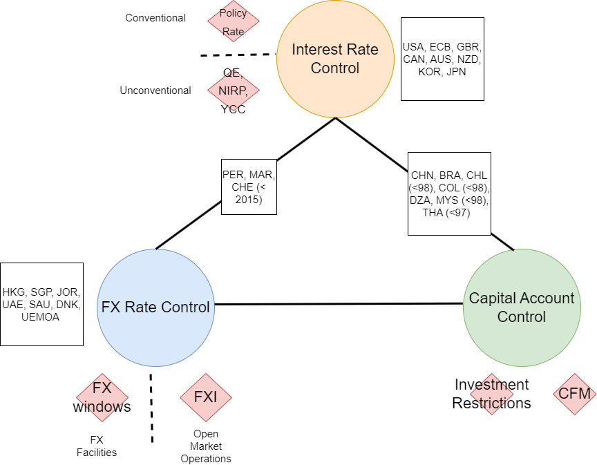

[Full slides of the course](../Slides/fxi_theory_practice/fxi_theory_practice.pdf)

# Conceptual Framework

## Monetary Frameworks

The choice of the monetary framework and the goals of the central bank is constrained by the Mundell Trilemma, that states that countries can only achieve two out of the three objectives:
 - Independent monetary policy: for instance, determining the interest rate to achieve domestic objectives, such as controlling inflation
 - Open capital account: capital flows can freely move in and out the country
 - Fixed exchange rate: the local currency is pegged to an anchor, for instance, the US dollar or the 

Most advanced economies have abandonned the fixed exchange rate objective after the collapse of the Bretton Woods system, and are therefore pursuing independent monetary objectives (inflation targeting or, in the past, money-base targeting) under an open capital account.

*Source: author*

Typically, countries trying to "round the corners of the trilemma", i.e. trying to achieve the three objectives simultaneously, will at a point face severe exchange rate/capital flows pressures if the objectives are not aligned. After burning their FX reserves to maintain a misaligned exchange rate level with open capital flows and independent monetary policy, countries will ultimately have to give up either open capital account or the peg. 

This situation occurred in South-East Asia at the end of the 1990s (the 1997 Asian Financial Crisis).

# Resources

  - A textbook presentation of foreing exchange interventions can be found in Sarno and Taylor (2012): [link](https://www.cambridge.org/core/books/abs/economics-of-exchange-rates/official-intervention-in-the-foreign-exchange-market/539435B26391C092195233098F887850)
        
 - The BIS publishes interesting papers reflecting BIS surveys conducted with central banks. For instance (2019): [link] (https://www.bis.org/publ/bppdf/bispap104b-rh.pdf)
    
 - A recent and quite comprehensive database on FX Interventions (2021), compiled by IMF colleagues: [link] (https://www.imf.org/en/Publications/WP/Issues/2021/02/19/Foreign-Exchange-Intervention-A-Dataset)

 - Kathryn Dominguez, professor at U-Michigan, specialized on FX interventions: [link](http://www-personal.umich.edu/~kathrynd/index.html)

 - Popper (2022) provides a very complete literature review on FX Interventions: [link](https://www.ssc.wisc.edu/~mchinn/Popper_FXI_apr22.pdf)

- Lafarguette and Veyrune (2021) who present a risk-based framework for FX interventions: [link](https://www.imf.org/en/Publications/WP/Issues/2021/02/12/Foreign-Exchange-Intervention-Rules-for-Central-Banks-A-Risk-based-Framework-50081)

## Conceptual Framework

- Monetary Frameworks and the Importance of FX policies

- Goals and Intermediate Objectives

- Monetary Frameworks

- Type of FX Interventions

- Transmission Channels

## Implementation

- Instruments

- Rule vs. Discretion

- FXI Size

- Communication

- Intervention Effectiveness

- FX Interventions and Exchange Rate Management

