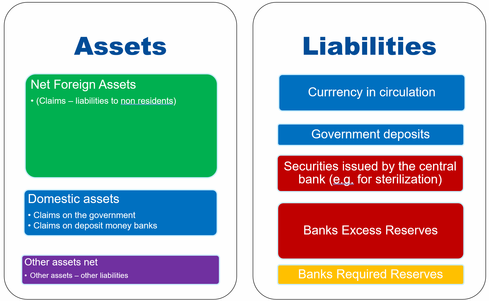
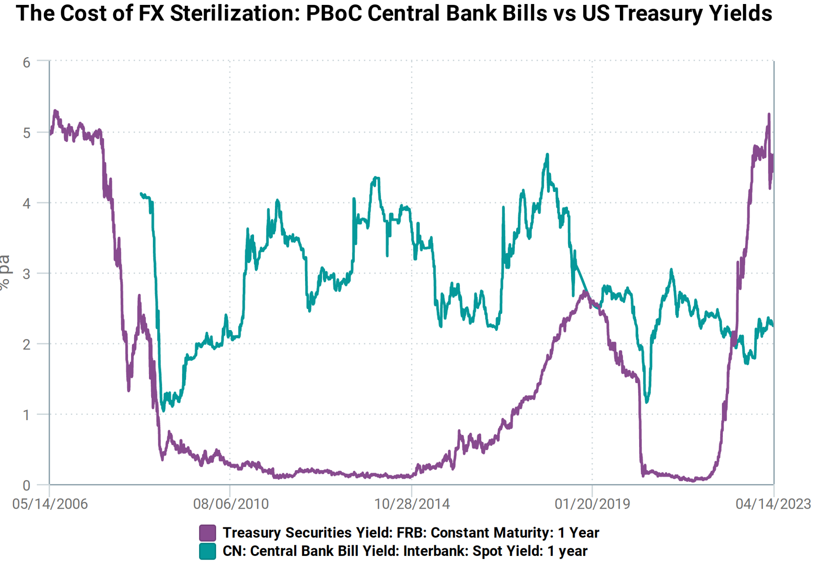
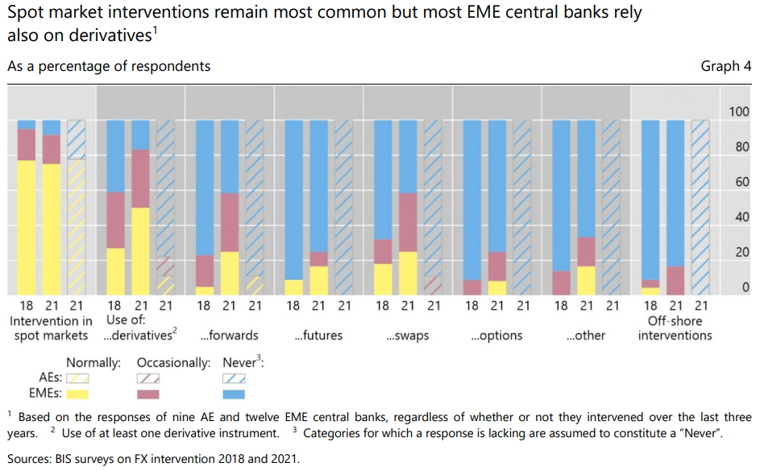

[Full slides of the course](../Slides/fxi_theory_practice/fxi_theory_practice.pdf)

<!-- https://cheatography.com/xaon/cheat-sheets/emacs-markdown-mode/  -->
# Theory of FX Interventions

## The Trilemma

`````{admonition} The Mundell Trilemma
:class: warning
The choice of the monetary framework and the goals of the central bank is constrained by the **Mundell Trilemma**, that states that countries can only achieve two out of the three objectives:
  * Independent monetary policy: for instance, determining the interest rate to achieve domestic objectives, such as controlling inflation 
  * Open capital account: capital flows can freely move in and out the country 
  * Fixed exchange rate: the local currency is pegged to an anchor, for instance, the US dollar or the 
`````

Most advanced economies have abandonned the fixed exchange rate objective after the collapse of the Bretton Woods system, and are therefore pursuing independent monetary objectives (inflation targeting or, in the past, money-base targeting) under an open capital account.

Diagram of the Mundell Trilemma with some countries illustration

*Source: Lafarguette*

Typically, countries trying to "round the corners of the trilemma", i.e. trying to achieve the three objectives simultaneously, will at a point face severe exchange rate/capital flows pressures if the fundamentals are not aligned. After burning their FX reserves to maintain a misaligned exchange rate level with open capital flows and independent monetary policy, countries will ultimately have to give up either open capital account or the peg. 

This situation occurred in South-East Asia at the end of the 1990s (the 1997 Asian Financial Crisis). At the time:
  * Most East-Asia countries in the 90s were *de facto* pegged to the USD 
  * Free mobility of capital (except in China)
  * Independent monetary policy with a high domestic interest rate to attract foreign investors
    * Countries were growing fast, foreign capital supplemented the lack of domestic savings
    * FX peg + high interest rate were generating a positive carry without FX risk for investors. Consequently, it fueled **hot money**
    * Huge credit boom: at the time, South-East Asia was receiving **half** of the world total capital flows to EM by the time 

These factors generated a **credit bubble** on over-leveraged economies, fueled by hot money

Hence, when the bubble bursted (first in Thailand), investors ran, triggering capital outflows and weakening currencies
  * Due to insufficient foreign reserves, countries were forced to devaluate, as FX interventions were not possible
  * The huge FX mismatch on banks and corporates balance sheets started a crisis, which was amplified by the interest rate hikes motivated to fight depreciation...


Exchange rate dynamics of South-East Asian Countries during the 1997 Asian Financial Crisis

*Source: Nikkei Asia and Refinitiv*


Evolution of the GDP of South-East Asian Countries during the 1997 Asian Financial Crisis

*Source: Mark Roser, Our World in Data*

    
## Goals and Intermediate Objectives

`````{admonition} Definition: FX Interventions
:class: definition
Any official sale or purchase of foreign assets against domestic assets **in the foreign exchange market** (onshore or offshore)
`````
* FX Interventions are usually carried-out by the central bank, but can sometimes be under the responsibility of the Ministry of Finances, such as in Japan ([link](https://www.mof.go.jp/english/policy/international_policy/reference/feio/index.html))

Typically, the central banking literature distinguishes between goals and objectives:

`````{admonition} Central Bank Goal
:class: important
Ultimate purpose of the FX intervention. Should be consistent with the monetary framework of the central bank
````` 
*For instance, a FX intervention goal for the central bank could be about preserving financial stability*


`````{admonition} Intermediate Objectives
:class: important
How to reach the goals via the central bank's operational framework
````` 
*For instance, mitigating FX daily volatility via open-market interventions*


### Main Goals Motivating Interventions on the FX market

- **Price stability**
  - When large exchange rate movements pass-through inflation, generating temporary shocks

- **Financial stability**
        - Calm "disorderly market conditions" (see [link](https://www.imf.org/-/media/Files/Publications/covid19-special-notes/en-special-series-on-covid-19-central-bank-support-for-foreign-exchange-markets.ashx)) for a discussion on how to assess disorderly market conditions)
        - Smooth capital flows and credit spillovers (impact on carry trade and excess returns)
        - Alleviate FX funding shortage
        - Reduce FX speculation

- **Terms of trade**
    - Support external competitiveness (especially during USD weakening phases)
    - Smooth commodity prices fluctuations

- **Building/managing FX reserves**
  - *In principle, without market impact*

- **Support fellow central banks in their exchange rate operations**

BIS Survey (2021) on Central Banks FX Interventions Goals

*Source: BIS 2021 [Link](https://www.bis.org/publ/bppdf/bispap104b_rh.pdf)*

`````{admonition} FXI should be consistent with the central bank's monetary framework
:class: warning
FX interventions should not contradict the central bank mandate, else there is a risk of policy inconsistency (cf. the Mundell Trilemma) that would jeopardize monetary efficiency and central bank credibility
````` 

**Floating exchange rate regimes** (for instance, with inflation targeting) should use FX interventions for:
    * Financial Stability
      * For instance, when domestic agents face severe currency mismatch on their balance sheet, FX volatility is a financial stability threat
  * Preservation of the monetary objectives
    * For instance, when the pass-through of large - and temporary - exchange rate movements threaten the inflation target 
    
**Hard-peg and currency board** regimes typically intervene on the FX market to defend the peg, usually via FX windows, at a fixed exchange rate

**Crawling and soft-peg** conduct infrequent FX interventions when the exchange rate deviates outside of the central bank tolerance
  * However, there is a risk of a conflict between _de-jure_ and _de-facto monetary_ objectives


### FX Intermediate Objectives
The literature (see the BIS below) and international practices typically identify 5 main intermediate objectives:

* **Limit exchange rate volatility**
  * Even if the main goal of the central bank is to maintain price stability, limiting FX volatility is often important. FX volatility affects the price-setting behavior of firms: it causes average imported inflation to rise
  * Excessive FX volatility can also derail the transmission of monetary policy

* **Provide liquidity** to thin market

* **Smooth the path** of the exchange rate

* Limit FX pressure caused by international investors

* Influence the level of the exchange rate (if the main goal of the central bank is indeed an exchange rate nominal anchor)

BIS Survey (2021) on Central Banks FX Interventions Intermediate Objectives

*Source: BIS 2021 [Link](https://www.bis.org/publ/bppdf/bispap104b_rh.pdf)*

`````{admonition} FX interventions consistent with floating exchange rate regimes can typically be designed to smooth exchange rate shocks, either:
:class: hint
  * **Permanent shock**: smoothing the exchange rate path dynamic to reach the new equilibrium 
  * **Temporary shock**: smooth the temporary impact while allowing the economy to quickly return back to the previous state
````` 

Example of FX Intervention to Smooth a Permanent Shock

*Source: IMF and Central Bank of Peru (2018) [Link](https://www.elibrary.imf.org/display/book/9781484375686/ch012.xml)*

Example of FX Intervention to Smooth a Transitory Shock

*Source: IMF and Central Bank of Peru (2018) [Link](https://www.elibrary.imf.org/display/book/9781484375686/ch012.xml)*


## Risks Associated with FX Interventions

Conducting FX interventions entail risks that central banks should be able to mitigate:

* **Moral hazard** and encouragement of greater risk-taking by market participants
* **Negative effects on market development** :e.g. hampering the development of the derivative markets by removing the need of currency hedge
  * ... which in turn increases the need for future FX interventions by the central bank in the future 
* Potential difficulties in balancing the **orderly functioning of local FX markets while maintaining openness to foreign investors**
* Possible inconsistencies between monetary policy and FX interventions, with complex interactions that are difficult to understand and communicate, which overall increases **policy uncertainty**

_Note that the risk-based FX intervention rule developped by [Lafarguette and Veyrune (2021)](https://www.imf.org/en/Publications/WP/Issues/2021/02/12/Foreign-Exchange-Intervention-Rules-for-Central-Banks-A-Risk-based-Framework-50081) is designed to address some of these issues_

    
## Sterilization of FX Interventions

### Typology

`````{admonition} Non-Sterilized Interventions
:class: definition
  * Buy and sell foreign assets against banks' reserves at the central bank
  * Increase or decrease the monetary base, and therefore impact the monetary stance
````` 

`````{admonition} Sterilized Interventions
:class: definition
* Buy and sell foreign assets against banks' reserves at the central bank
* Sterilize the intervention by either:
  * selling or purchasing home-currency assets
  * or issuing of sterilization instruments 
* No impact on the monetary stance
````` 

Non-sterilized interventions imply a change of the monetary stance and can directly conflict with the monetary objectives. 

Sterilized interventions should be preferred, as they allow the central bank to isolate their impact to the FX market only. Typically, sterilization is conducted by absorbing liquidity (when buying FX reserves) or by injecting liquidity (when selling FX reserves), so that the volume of banks' reserves at the central bank doesn't change. 

To sterilize, the central bank has to rely on specific operations and instruments:
    - By **buying or selling domestic assets** (usually, domestic sovereign bonds), to offset the impact of the change in foreign reserves (net foreign assets)
    - By **issuing central bank securities** (for instance, sterilization bills or certificates of deposits) to absorb domestic liquidity from banks when buying foreign reserves
    - By **tilting the required reserves ratio (RRR)**, to inject or absorb liquidity. However, it is preferable to keep the RRR stable over time, and this instrument should be use to accomodate structural changes in the liquidity position


Central Bank Analytical Balance Sheet

*Source: Lafarguette*
    
### Can All Central Banks Sterilize?

In practice, it may be difficult to fully offset the effects of FX interventions as:
  * Countries with under-developed financial markets might not offer enough assets for the central bank to sterilize
  * There are second-round effects that dampen the impact of sterilization
    * _For instance: after FXI (buying), sterilization via domestic assets sale, attracts capital inflows, the CB will have to purchase FX further, etc._

One potential solution is to use **FX derivatives**
  * For instance, some East-Asian central banks have been using FX swaps to sterilize their interventions 
    * Purchasing FX on the spot
    * Swap by selling FX spot, unwinding by buying FX in the future

### Costs of FX Interventions

Central Bank Analytical Balance Sheet with Remuneration and Costs

*Source: Lafarguette*

`````{admonition} Costs of FX Interventions
:class: important
* FX Interventions entail fiscal and valuation costs
````` 

* **Fiscal costs**
  * Depends on the interest rate differential between domestic and foreign assets, in particular the returns of FX reserves
  * Typically, the domestic interest rate is often higher than the foreign interest rate (US Treasuries for instance): the remuneration of the foreign reserves is below the cost of the sterilization instruments
  * This is the cost of the conduct of monetary policy. It is crucial to be consistent, even if it implies a cost for the central bank
    * Note that some central banks try to pass the costs to the banking sector, either via the required reserves (FX or domestic, high ratio with below-market remuneration) or forced-holdings of sterilization assets remunerated below market rate
    * This is a form of financial repression, and is not advised...

* **Valuation costs**
  * Foreign reserves expose the central bank to foreign exchange risk
  * If the foreign currency depreciates, the valuation losses on the FX reserves will reduce the central bank equity
    * For instance, the Swiss National Bank (SNB) had to intervene to prevent an appreciation of the Franc that ended up FX reserves representing 130\% of GDP, 12-times increase since 2012
    * Valuation losses in 2022 of 95 bn CHF (105 bn USD), or 15 \% of GDP... (were absorbed by SNB very large equity buffer)

PBOC Key Interest Rates on the Balance Sheet

*Source: CEIC*


PBOC Foreign Reserves

*Source: CEIC*


Franc Suisse against Euro (Down Means CHF Appreciation)

*Source: Bloomberg*

Franc Suisse against Euro (Down Means CHF Appreciation)

*Source: Bloomberg*

## Transmission Channels of FX Interventions

FX interventions influence the exchange rate through two main channels:

* **Signaling channel**
  * Signal the future monetary policy stance
  * Signal future exchange rate and FX interventions

* **Portfolio and risk-rebalancing channel**

### Signaling channel

FX Interventions provide investors with "information" about the central bank view of the appropriate exchange rate. They also signal future monetary policy intentions.

The signal sent by the central bank when conducting FX interventions often plays an important role for steering market participants expectations. 

`````{admonition} As long as the **central bank is credible**, the signal can influence the exchange rate
:class: danger
````` 

Despite the signaling effect, some central banks prefer to keep their interventions secret, even ex-post, because:
  * Fear of losing credibility if the intervention is unsuccessful
  * "Wants to keep control", tradition of secrecy
  * Shield from political repercussions

_Empirical evidence tend to suggest that the signaling effect indeed plays an important role, and that secret FX interventions should, in general, be avoided (see later for a discussion)_


### The portfolio rebalancing channel

The portfolio rebalancing channel occurs when the central bank manages to shift the relative supply of foreign versus domestic assets on the market. 
  * Because the supply changes, the expected FX returns and FX level is changing as well. 
      * For example, after a sterilized FXI selling-side, the central bank increases the supply of foreign assets, depreciating the foreign currency

Sterilized FX interventions also alter the **risk characteristics** of foreign/domestic assets
  * Domestic investors are exposed to FX risk when holding foreign assets
  * Sterilized interventions influence the equilibrium exchange rate via a change in the **risk premia**

The portfolio rebalancing channel is maximized when:
  * Investors **diversify their holdings** domestic/foreign as a function of **expected returns and variance of returns**
  * **Foreign and domestic assets are imperfect substitutes**: the uncovered interest parity doesn't hold

|            | Signaling                    | Portfolio Rebalancing                     |
|------------|------------------------------|-------------------------------------------|
| Assumption | The central bank is credible | Assets are imperfect substitutes          |
| Channel    | Market Expectations          | Relative supply and returns, risk premium |
|            |                              |                                           |

# FXI Implementation

`````{admonition} Challenges
:class: caution
Countries, and in particular EMEs, face implementations issues when framing their FX interventions strategy
`````
Typically, the common challenges faced by central banks are:
  * How to decide about the appropriate **timing** of FX interventions?
  * Should interventions be **discretionary or follow rules**?
    * When using rules, what kind of rules?  
  * What is the **optimal FXI size** to maximize efficiency while preserving the sustainability of the central banks' foreign reserves? 
  * **Instruments**: intervening through spot or derivatives, or both?  
  * Should CBs provide targeted FX provision to specific banks or engage in **open-market FX interventions**?
  * Under what conditions is it appropriate to deploy intervention and capital controls jointly?

## FXI Timing
Deciding on the right FXI timing is critical and entail significant risks:
  * The central bank doesn't want to intervene too often, at the risk to create market distortions, lose credibility and exhaust FX reserves
  * Still, need to intervene often enough to preserve financial stability and mitigate volatility, for instance, when domestic agents are unsufficiently hedged
  * When is the right time for intervening? Monitoring market conditions, spotting market dysfunctions, exchanging information with market participants is often critical
* Some simple rules with fixed thresholds (e.g. intervening when the daily variation exceeds +/- 2\%) often guidance, at the risk of creating speculation
  * [Lafarguette and Veyrune (2021)](https://www.imf.org/en/Publications/WP/Issues/2021/02/12/Foreign-Exchange-Intervention-Rules-for-Central-Banks-A-Risk-based-Framework-50081) designed a rule to decide on the optimal triggers for FX interventions based on risk level
  * Even under a discretionary framework, quantitative-based metrics can serve as a useful guide

## FXI: Rule vs Discretion
Rule vs. discretion is an old debate in the academic literature (see [Popper 2022](https://www.ssc.wisc.edu/~mchinn/Popper_FXI_apr22.pdf) for a review)

Often, central banks prefer to operate via **un-disclosed, discretionary interventions**
  * Idea to "surprise the market"
  * No commitment for intervening, given the central bank some perception that it controls better its level of foreign reserves
  * In general the empirical evidence suggest that the effect of the "surprises" triggered by discretionary FX interventions fades very fast, within hours
  * "Surprising the market" can be detrimental, especially when liquidity is scarce and the volatility already high
  
On the contrary, some central banks use **rule-based systems** to decide on their FX interventions timing:
  * Indicates no explicit intention to target an exchange rate level
  * Aligned with the monetary objectives (if the rule is correctly defined)
  * Maximize the signaling channel, help agents forming their expectations
  * Helps the central bank to shield-off political pressures
  * Should be properly designed to avoid speculative behavior

A few countries have implemented rules-based interventions:
  * Mexico, Chile and Columbia: these countries have implemented rules-based programs of pre-announced daily purchases/sales of FX
  * Czech Republic, Swizterland and Russia (early 2010s) used to have "automatic interventions" on electronic trading platforms

[Academic evidence, Dominguez et al. 2013](https://onlinelibrary.wiley.com/doi/10.1111/jmcb.12028) from the Czech National Bank Interventions suggest that rule-based interventions were more effective in sterring the exchange rate than discretionary interventions

In practice, assessing central banks' rules vs. discretion in practice is difficult, because:
  * Central banks often don't follow a rigid rule: it is therefore difficult to quantify their objectives and rationales
  * Policies are often **episodic**: interventions can be frequent during some periods and much less in other periods
  * The FX interventions are largely geared towards "leaning against the wind", to react against deviations from target

The BIS conducts regular surveys on central banks practices in FX interventions and ask about rules vs discretion practice. 
Out of the 21 central banks surveyed, only one thir of them used rules for intervening on the FX market. 

*Source: [BIS 2021](https://www.bis.org/publ/mc_insights_fxinterventions.pdf)*


## FX Intervention Size and Frequency

To the best of our knowledge, there is no theoretical model providing guidance on the  optimal FX intervention  amount to buy or  sell on the  market, either during one intervention or a day (if multiple interventions per day).

`````{admonition} General guidance
:class: tip
The general guidance is to intervene infrequently, with relatively large amounts, measured as share of the daily market turnover. The purpose is to:
  * Maximize market impact
  * Maximize the signaling effect
  * Gain credibility
`````

Based on international practices, cumulated FX interventions during a day represent between 15% and 20% of daily market turnover, with some central banks intervening more than 50% of the daily market turnover 
  * This amount represent between 0.3% and 0.8% of the monthly FX reserves

For regular interveners, the frequency of interventions during "normal years" (excluding for instance COVID year) is around 10 to 15 days per year
  * But can climb up to 80 business days per year in 2020!

Results on the 2021 BIS Survey on FX intervention size and frequency

*Source: [BIS 2021](https://www.bis.org/publ/mc_insights_fxinterventions.pdf)*


`````{admonition} Critical points to consider
:class: urgent
To decide about the specific amount for a given intervention, it is critical to consider:
  * The level of the foreign reserves of the central bank, and in particular, its buffer compared to the adequate reserves level (for instance, using the [IMF ARA metric](https://www.imf.org/external/datamapper/datasets/ARA) or any other metric)
  * Assess the liquidity conditions and the FX market impact
  * The amount is usually calibrated as percent of the daily FX market turnover
`````

## Targeted vs Open-Market Interventions

In general, FX interventions should be conducted via open-market interventions, in order to:
  * Reduce market distortions
  * Maximize the signaling effect, transparent operations
  * Create an level-playing field for market participants to avoid market discrimination
  * Reduce political pressure and interferences to supply a given participant with FX

However, even if FX interventions are not targeted, banks take-up is unlikely to be uniform (and this is true for FX facilities too).

In some very specific circumstances, some systemically important FX players (banks, large importers/exporters) may require targeted interventions, particularly when the volumes are so large that they would destabilize the market. This is the case, for instance, with large commodities exporters.


## FX Instruments

`````{admonition} Instruments for FX interventions
:class: tip
Typically, central banks use a set of instruments to conduct their interventions, including:
  * FX spot
  * FX forward and FX non-deliverable forwards (NDF)
  * FX swaps
  * FX repos
  * FX options
`````

Deciding on whether to use spot or derivatives instruments should be based on the pros and cons of each instruments. 

Typically, spot interventions are:
  * Standard intervention on the spot market
  * Provides a direct impact on the exchange rate, and no arbitrage transmission needed
  * Provide immediate FX provision to the market
  * However, spot FXI are limited by the size of the foreign reserves (when selling)
  * In some countries, the spot market might be less liquid than the derivative market

Some central banks might prefer to use derivatives instead of spot FXI, because:
  * Derivative FXI provide an hedge against FX risk
  * Derivative FXI influence the liquidity on the derivative market, which in turn improves the spot/derivative market arbitrage
  * Preserve FX reserves if the derivatives are settled in local currency, as in the case of NDF or non-deliverable swaps
  
For instance, the BCB (Brazil) was using non-deliverables FX swaps which were:
  * Settled in local currency and had no impact on foreign reserves
  * Fills a market gap in longer-term derivatives instruments (serves as a risk management insurance)


`````{admonition} Intertemporal and risk considerations
:class: warning
Using spot versus derivatives also entail **intertemporal and risk considerations**:
  * **Spot FXI**: provides immediate FX provision to the market
  * **Forward FXI**: transfer FX risk immediately
  * **Option-based FIX**: provides an insurance against FX risk, that may or may not be exercised
  * **Repos and swap-based FXI**: provide FX for the duration of the repo or swap, providing a hedge against maturity mismatches in FX
`````

Advanced economies (AE) and emerging markets economies (EME) differ on how they implement FX interventions. 

In general, AEs tend to intervene exclusively in the spot market, and often, relatively infrequently, as they operate floating exchange rate regimes (at the exception of Switzerland in the early 2010s that maintained a floor on the CHF).

However, many EMEs intervene in derivatives markets. For instance:
  * The Bank of Thailand used forward market purchases to support the baht in 1997
  * The Bank of Mexico sold put options on the USD to accumulate USD reserves in the 1990s
  * Other Latin America countries in the 1990s also intervened via derivatives, such as Chile, Brazil, Peru
  * More recently, a growing list of EMEs are still intervening on the derivatives market: Brazil, Colombia, India, Indonesia, Mexico, South-Africa, Thailand

According to the 2021 BIS survey, the forward and swaps were the most used derivatives instruments by central banks for FX interventions, and around 40% of them were using derivatives frequently, and another third occasionally. 

Results on the 2021 BIS Survey on FX intervention instruments

*Source: [BIS 2021](https://www.bis.org/publ/mc_insights_fxinterventions.pdf)*


## Profitability of FX interventions

Empirical evidence suggests that profits vary significantly according to the sample periodm but generally, FX intervention is profitable as:
  * When selling, the central bank is providing FX liquidity at a time of stress, hence can sell expensive
  * When buying, the central bank is absorbing FX liquidity when liquidity is ample, hence can buy cheap

[Lafarguette and Veyrune 2021](https://www.imf.org/en/Publications/WP/Issues/2021/02/12/Foreign-Exchange-Intervention-Rules-for-Central-Banks-A-Risk-based-Framework-50081) show that, in the case of Mexico:
  * Rules-based FX interventions are more profitable than discretionary rules
  * Their risk-based intervention rule is the most profitable, as the central bank is buying/selling on the tails of the FX distribution. 


## Communication around FX interventions

There is little consensus among central banks, in particular regarding ex-post communication (data, amounts, etc.).

`````{admonition} Communication and transparency
:class: caution
**Signaling** is important transmission channel of foreign exchange interventions and can only be achieved with communication and transparency
`````

`````{admonition} Pitfalls
:class: warning
"Surprising the market" via undisclosed FX interventions can be detrimental, especially when liquidity is scarce and the volatility is already high
`````
To the best of our knowledge, there is no evidence in the literature that secret and unexpected interventions are more efficient, especially after the initial first hours
  * On the contrary, unexpected interventions effects tend to fade quite fast
  * Unexpected FX interventions tend to impede anchoring **FX market expectations** and **harm the credibility** of the central bank ("desperate move")


Based on the 2021 BIS survey on FXI practices, it seems that more than 2/3 of central banks are communicating ex-post about their FX interventions, while only 40% of them are conducting pre-annouced interventions. 

BIS Survey on FXI Communication

*Source: [BIS 2021](https://www.bis.org/publ/mc_insights_fxinterventions.pdf)*


BIS Survey on Publication of FX Interventions

*Source: [BIS 2021](https://www.bis.org/publ/mc_insights_fxinterventions.pdf)*

Some central banks offer public intervention data, for instance through the website of [FRED (Federal Reserve Bank of St Louis)](https://fred.stlouisfed.org/):
  * Australia (1983-2006)
  * Germany (1976-1995)
  * Italy (1988-1998)
  * Japan (1991-2022)
  * Mexico (1997-2011)
  * Switzerland (1975-2001)
  * Turkey (2002-2019)
  * United States (1973-2003)

Some central banks also publish information about their FX interventions on their website:
  * Argentina
  * Chile
  * Georgia
  * Kyrgyz Republic
  * United Kingdom


## FX Intervention Effectiveness

`````{admonition} Challenges in assessing FX Intervention Effectiveness
:class: warning
It is in general very difficult to assess the effectiveness of FX intervention, due to simultaneity issues
`````
The decision to intervene is often not independent from the movements in the exchange rate
  * Most likely, FX intervention occur in reaction to unwanted exchange rate changes

The decision to intervene may also be part of a broader set of policy actions (monetary and/or fiscal policy, capital controls, etc.), potentially leading to an **overestimation bias** on FX intervention effectiveness.
  * Studies based on high-frequency data (intra-daily) maybe be less subject to the **simultaneity bias** but can't assess whether intervention has lasting effects
  * The [BIS 2013](https://www.bis.org/publ/bppdf/bispap73.htm) has released a paper discussing FXI effectiveness for Chile, Colombia, Mexico, Peru, etc. during the GFC
  * Another example, using the **regression discontinuity** design around a rule threshold, as done by [Kuersteiner et al. 2018](https://econpapers.repec.org/paper/bdrborrec/965.htm) on Columbia FX interventions.
  * Other researchers have used **counterfactual matching** to construct a synthetic group as counterfactual
    * Counterfactual uses data from other countries, with weights based on the co-movemevent with the currency of interest 
    * Not appropriate for frequent interventions but useful at the event level
    * Can not be used in the case of a global shock
    

The results of a comprehensive study (not intra-day) by [Fratzscher et al. 2019](https://www.aeaweb.org/articles?id=10.1257/mac.20150317) suggest that central banks:
  * Have around 60% success in the ability to **influence the direction** of the exchange rate
    * The success rate is higher if interventions are large and are accompanied by pre-announced communication
  * 80% success in **smoothing the path of the exchange rate**
    * As observed by a reduction in exchange rate variation in the week after the intervention vs. the week before
  * 80% success in stabilizing the exchange rate in a 2% narrow band during the next two weeks


## FX Interventions and Capital Flows Management

Capital flow management (CFM) may increase the efficacy of sterilized FX interventions by reducing foreign and domestic asset substituability
  * Firms in EME issue more and more foreign currency debt, while EME sovereign debt is increasingly in local currency (with a larger fraction held by foreigners). Therefore:
    * Currencies and domestic financing conditions are more exposed to swings in capital flows
    
In this context, EME may need/want full access to all policy tools given these vulnerabilities

Foreign exchange interventions and capital flows management are rather complementary than substitutes:
  * FXI is a more flexible tool, with much less market distortions, but often requires enough FX reserves/credibility to be efficient 
  * CFM is an administrative measure with immediate effect, that can be implemented without FX reserves, but can be highly distortionary and create a stigma 

Capital flows management is a complex topic, and should be applied with care. We don't cover it here. For more information, see [IMF](https://www.imf.org/en/Topics/Capital-Flows)


# Resources

I present below a few key interesting resources regarding central banks interventions on the FX market:

  - A textbook presentation of foreing exchange interventions can be found in Sarno and Taylor (2012): [link](https://www.cambridge.org/core/books/abs/economics-of-exchange-rates/official-intervention-in-the-foreign-exchange-market/539435B26391C092195233098F887850)

 - The IMF has published a guidance note on FX interventions on the spot and derivatives market (2021): [link](https://www.imf.org/-/media/Files/Publications/covid19-special-notes/en-special-series-on-covid-19-central-bank-support-for-foreign-exchange-markets.ashx)           

 - The BIS publishes interesting papers reflecting BIS surveys conducted with central banks. For instance (2019): [link](https://www.bis.org/publ/bppdf/bispap104b-rh.pdf)
    
 - A recent and quite comprehensive database on FX Interventions (2021), compiled by IMF colleagues: [link](https://www.imf.org/en/Publications/WP/Issues/2021/02/19/Foreign-Exchange-Intervention-A-Dataset)

- Lafarguette and Veyrune (2021) designed a risk-based framework for FX interventions: [link](https://www.imf.org/en/Publications/WP/Issues/2021/02/12/Foreign-Exchange-Intervention-Rules-for-Central-Banks-A-Risk-based-Framework-50081)

- Popper (2022) provides a very complete literature review on FX Interventions: [link](https://www.ssc.wisc.edu/~mchinn/Popper_FXI_apr22.pdf)

- Kathryn Dominguez, professor at U-Michigan, specialized on FX interventions: [link](http://www-personal.umich.edu/~kathrynd/index.html)

- [Kuersteiner et al. (2018)](https://www.sciencedirect.com/science/article/abs/pii/S0022199618300771) provide an in-depth analysis of the effectiveness of sterilized foreign exchange interventions in Colombia, using tick-by-tick data for a clean identification of the FXI impact

- An interesting academic paper with a policy angle, oriented towards the comparison between FX interventions in Israel and in Switzerland: [Cukierman 2019](https://link.springer.com/article/10.1007/s11079-019-09522-0)

- General useful resource: the IMF Glossary [link](https://www.imf.org/en/About/Glossary)


  
